# System Overview - ODIBI DE v2 Framework

## Table of Contents
- [Purpose](#purpose)
- [Architecture Philosophy](#architecture-philosophy)
- [Medallion Flow Diagram](#medallion-flow-diagram)
- [Config-Driven Model](#config-driven-model)
- [Core Components Interaction](#core-components-interaction)
- [Dual-Engine Architecture](#dual-engine-architecture)

---

## Purpose

ODIBI DE v2 is a **production-grade data engineering framework** designed for building scalable, config-driven data pipelines on Spark and Pandas. It supports:

- **Medallion Architecture**: Bronze → Silver → Gold layer pattern
- **Dual-Engine Execution**: Run transformations on Spark or Pandas
- **Config-Driven Pipelines**: Define pipelines in metadata tables, no code changes needed
- **Event-Driven Workflows**: Hooks system for lifecycle callbacks
- **Multi-Tenant Support**: Project and environment isolation
- **Cloud-Native**: Azure Blob Storage (ADLS), Databricks, Delta Lake integration

---

## Architecture Philosophy

### Design Principles

1. **Configuration Over Code**: Pipeline logic lives in metadata tables (`TransformationRegistry`, `IngestionSourceConfig`), not hardcoded modules
2. **Pluggable Components**: Swap readers, savers, transformers, and log sinks without changing orchestration logic
3. **Engine Agnostic**: Write once, run on Spark or Pandas via `Engine` enum
4. **Event-Driven**: React to pipeline events (pre_read, post_transform, on_error) using hooks
5. **Manifest-Based Projects**: Each project defines its own structure via `manifest.json`

### Framework Layers

```
┌─────────────────────────────────────────────────────────┐
│          🎯 Project Manifest (manifest.json)            │
│  Defines layer order, caching, entities, environments   │
└─────────────────────────────────────────────────────────┘
                          ↓
┌─────────────────────────────────────────────────────────┐
│     🚀 GenericProjectOrchestrator (Orchestration)       │
│  Universal pipeline runner for any project/environment  │
└─────────────────────────────────────────────────────────┘
                          ↓
         ┌────────────────┴────────────────┐
         ↓                                  ↓
┌──────────────────────┐         ┌──────────────────────┐
│  Bronze (Ingestion)  │         │  Silver/Gold (ETL)   │
│  IngestionOrchestrator│        │  TransformationRunner│
└──────────────────────┘         └──────────────────────┘
         ↓                                  ↓
┌─────────────────────────────────────────────────────────┐
│      📊 Data Lake (Delta Tables / Parquet / CSV)        │
│     Bronze Layer → Silver Layer → Gold Layer            │
└─────────────────────────────────────────────────────────┘
```

---

## Medallion Flow Diagram

The framework implements a classic medallion architecture with configurable layers:

```mermaid
graph LR
    A[📁 Raw Data Sources] -->|Ingestion| B[🥉 Bronze Layer]
    B -->|Cleanse & Validate| C[🥈 Silver Layer]
    C -->|Aggregate & Enrich| D[🥇 Gold Layer]
    D -->|Consumption| E[📊 Analytics/ML/Reports]
    
    style A fill:#e1f5ff
    style B fill:#cd7f32,color:#fff
    style C fill:#c0c0c0
    style D fill:#ffd700
    style E fill:#d4edda
```



### Layer Responsibilities

| Layer | Purpose | Typical Operations | Storage Format |
|-------|---------|-------------------|----------------|
| **Bronze** | Raw ingestion | Read from sources, minimal schema enforcement | Delta/Parquet |
| **Silver** | Data quality | Deduplication, type casting, validation, joins | Delta |
| **Gold** | Business logic | Aggregations, KPIs, feature engineering | Delta/Tables |

### Example Multi-Layer Pipeline


---

## Config-Driven Model

### Core Concept

**Everything is configured, not coded.** You define:

1. **What to ingest**: `IngestionSourceConfig` table (sources, schemas, targets)
2. **How to transform**: `TransformationRegistry` table (functions, parameters, order)
3. **Project structure**: `manifest.json` (layers, dependencies, caching)

### Configuration Tables

#### 1. IngestionSourceConfig (Bronze)

```sql
CREATE TABLE IngestionSourceConfig (
    ingestion_id STRING,
    project STRING,
    environment STRING,
    source_type STRING,           -- "csv", "sql", "api", "blob"
    source_path STRING,
    target_table STRING,
    schema_definition TEXT,
    enabled BOOLEAN
)
```

#### 2. TransformationRegistry (Silver/Gold)

```json
{
  "transformation_id": "T001",
  "project": "Energy Efficiency",
  "environment": "qat",
  "layer": "Silver_1",
  "module": "odibi_functions.examples",
  "function": "deduplicate_spark",
  "inputs": ["bronze.raw_energy_data"],
  "constants": {
    "subset": ["meter_id", "timestamp"],
    "engine": "spark"
  },
  "outputs": ["silver.energy_data_clean"],
  "enabled": true
}
```

#### 3. Project Manifest (manifest.json)

```json
{
  "project_name": "Energy Efficiency",
  "project_type": "analytics",
  "layer_order": ["Bronze", "Silver_1", "Silver_2", "Gold_1"],
  "layers": {
    "Silver_1": {
      "name": "Silver_1",
      "depends_on": ["Bronze"],
      "cache_tables": ["silver.energy_data_clean"]
    }
  },
  "cache_plan": {
    "Silver_1": ["silver.energy_data_clean", "silver.sensor_readings"]
  }
}
```

---

## Core Components Interaction

### Orchestration → Registry → Hooks Flow


### Component Responsibilities

| Component | Responsibility | Input | Output |
|-----------|---------------|-------|--------|
| **GenericProjectOrchestrator** | Project-level execution | manifest.json, env | Orchestrated pipeline |
| **TransformationRunnerFromConfig** | Execute transformations | TransformationRegistry rows | Updated Delta tables |
| **FunctionRegistry** | Resolve functions | (module, function, engine) | Callable function |
| **HookManager** | Event callbacks | (event, payload) | Triggered hooks |
| **ProjectManifest** | Config schema | manifest.json | Validated config |

---

## Dual-Engine Architecture

### Engine Selection Strategy

```python
from odibi_de_v2.core import Engine, ExecutionContext

# 1. Framework-level default (orchestrator)
orchestrator = GenericProjectOrchestrator(
    project="Energy Efficiency",
    env="qat",
    engine="spark"  # Default for all transformations
)

# 2. Per-transformation override (in TransformationRegistry)
{
  "transformation_id": "T002",
  "constants": {
    "engine": "pandas"  # This specific transformation runs on pandas
  }
}
```

### Engine Enum

```python
class Engine(Enum):
    SPARK = "spark"
    PANDAS = "pandas"
```

### ExecutionContext

Encapsulates runtime state for dual-engine functions:

```python
@dataclass
class ExecutionContext:
    engine: Engine              # SPARK or PANDAS
    project: str                # "Energy Efficiency"
    env: str                    # "qat", "prod"
    spark: Optional[Any]        # SparkSession (if engine=SPARK)
    sql_provider: Optional[Any] # SQL query provider
    logger: Optional[Any]       # DynamicLogger instance
    hooks: Optional[HookManager]# Event system
    extras: Dict[str, Any]      # Custom metadata (plant, asset, etc.)
```

### Function Resolution Flow


---

## Quick Start Example

### 1. Define Project Manifest

```json
{
  "project_name": "Customer Analytics",
  "project_type": "analytics",
  "layer_order": ["Bronze", "Silver", "Gold"],
  "environments": ["dev", "qat", "prod"]
}
```

### 2. Register Transformation Function

```python
from odibi_de_v2.odibi_functions import spark_function

@spark_function(module="analytics", description="Deduplicate customers")
def remove_duplicate_customers(df, context=None):
    return df.dropDuplicates(["customer_id"])
```

### 3. Add TransformationRegistry Entry

```sql
INSERT INTO TransformationRegistry VALUES (
    'T001',
    'Customer Analytics',
    'dev',
    'Silver',
    'analytics',
    'remove_duplicate_customers',
    '["bronze.raw_customers"]',
    '{}',
    '["silver.customers_clean"]',
    true
)
```

### 4. Run Pipeline

```python
from odibi_de_v2.orchestration import GenericProjectOrchestrator

orchestrator = GenericProjectOrchestrator(
    project="Customer Analytics",
    env="dev",
    log_level="INFO"
)

orchestrator.run_project()
```

---

## Next Steps

- **[01-CORE_COMPONENTS.md](01-CORE_COMPONENTS.md)**: Deep dive into orchestrator, runner, registry, hooks
- **[02-DATAFLOW_EXAMPLES.md](02-DATAFLOW_EXAMPLES.md)**: Step-by-step dataflow walkthroughs
- **[03-EXTENDING_FRAMEWORK.md](03-EXTENDING_FRAMEWORK.md)**: How to add custom functions and transformations
- **[04-GLOSSARY.md](04-GLOSSARY.md)**: Complete reference of classes and configs
- **[ARCHITECTURE_MAP.md](ARCHITECTURE_MAP.md)**: Visual module dependency diagrams
