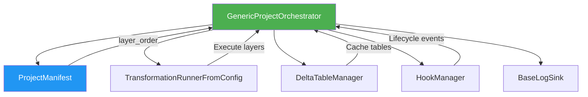
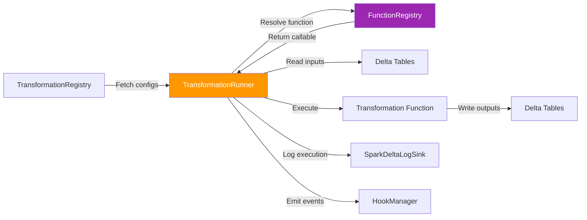
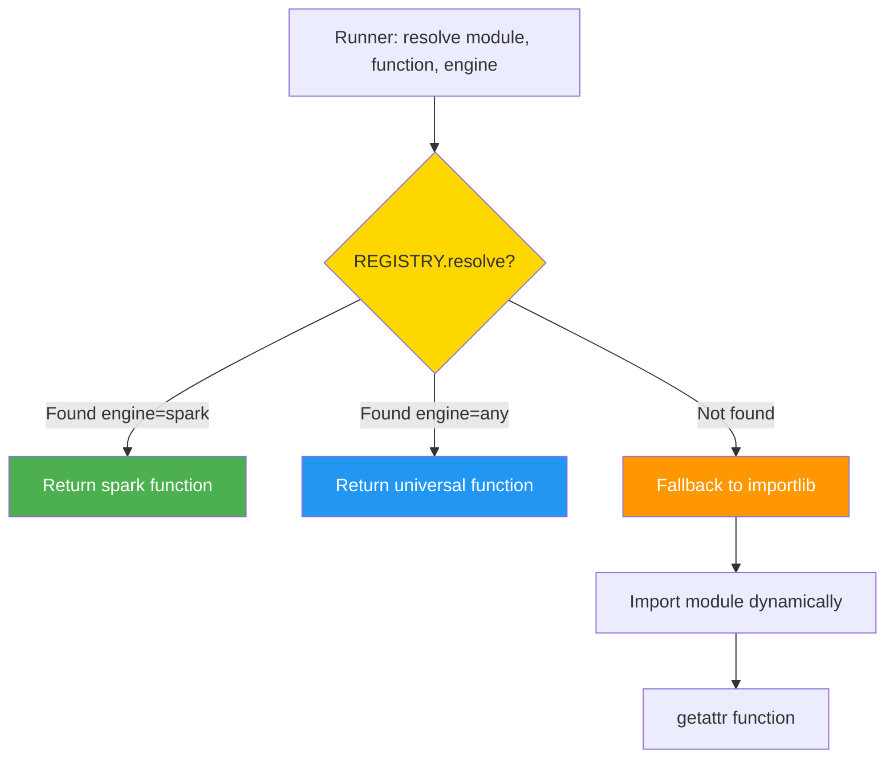

# Core Components Deep Dive

## Table of Contents
- [GenericProjectOrchestrator](#genericprojectorchestrator)
- [TransformationRunnerFromConfig](#transformationrunnerfromconfig)
- [FunctionRegistry & Decorators](#functionregistry--decorators)
- [TransformationRegistry & Manifest](#transformationregistry--manifest)
- [Dual-Engine Architecture](#dual-engine-architecture)
- [Hooks System](#hooks-system)

---

## GenericProjectOrchestrator

**Path**: `odibi_de_v2/orchestration/generic_orchestrator.py`

### Purpose

Universal orchestration engine for **any** data pipeline project. Environment and project-agnostic, driven by manifests and metadata tables.

### Key Responsibilities

1. ✅ **Manifest-Driven Execution**: Load project configuration from `manifest.json`
2. ✅ **Bronze Layer Execution**: Trigger ingestion jobs via `IngestionSourceConfig`
3. ✅ **Silver & Gold Transformations**: Execute layers via `TransformationRunnerFromConfig`
4. ✅ **Smart Caching**: Cache Delta tables after each layer
5. ✅ **Authentication Abstraction**: Pluggable auth providers for different environments
6. ✅ **Log Management**: Structured logging with optional ADLS persistence

### Architecture



### Constructor Parameters

```python
class GenericProjectOrchestrator(BaseProjectOrchestrator):
    def __init__(
        self,
        project: str,                    # Project name (e.g., "Energy Efficiency")
        env: str = "qat",                # Environment (qat, prod, dev)
        manifest_path: Optional[Path] = None,  # Path to manifest.json
        log_level: str = "WARNING",      # INFO, WARNING, ERROR
        save_logs: bool = False,         # Persist logs to storage
        log_container: str = "digital-manufacturing",
        auth_provider: Optional[callable] = None,  # Auth function
        engine: str = "spark",           # Default engine (spark/pandas)
        hooks: Optional[HookManager] = None,
        **kwargs
    ):
```

### Key Methods

#### `run_project(layers=None, cache_plan=None)`

Execute the entire project pipeline or specific layers.

**Parameters**:
- `layers` (Optional[List[str]]): Specific layers to run. If None, runs all layers from manifest
- `cache_plan` (Optional[Dict]): Override manifest caching strategy

**Flow**:
1. Load project manifest
2. Validate layer dependencies
3. For each layer in `layer_order`:
   - Emit `pipeline_start` hook
   - Run Bronze (ingestion) or Silver/Gold (transformations)
   - Cache Delta tables if configured
   - Emit `pipeline_end` hook

**Example**:
```python
from odibi_de_v2.orchestration import GenericProjectOrchestrator

orchestrator = GenericProjectOrchestrator(
    project="Energy Efficiency",
    env="qat",
    log_level="INFO",
    save_logs=True,
    engine="spark"
)

# Run all layers from manifest
orchestrator.run_project()

# Run specific layers only
orchestrator.run_project(layers=["Silver_1", "Gold_1"])

# Override cache plan
orchestrator.run_project(
    cache_plan={
        "Silver_1": ["silver.energy_clean"],
        "Gold_1": ["gold.daily_aggregates"]
    }
)
```

#### `run_bronze_layer()`

Execute ingestion jobs for Bronze layer.

**Flow**:
1. Fetch `IngestionSourceConfig` for project/env
2. Initialize `IngestionOrchestrator`
3. Run all enabled ingestion jobs
4. Return summary of ingestion results

**Example**:
```python
orchestrator = GenericProjectOrchestrator(
    project="Energy Efficiency",
    env="qat"
)

# Run only Bronze ingestion
results = orchestrator.run_bronze_layer()
print(f"Ingested {results['success_count']} tables")
```

#### `run_transformation_layer(layer_name)`

Execute transformations for a specific layer (Silver/Gold).

**Parameters**:
- `layer_name` (str): Layer identifier (e.g., "Silver_1", "Gold_2")

**Flow**:
1. Fetch `TransformationRegistry` configs for layer
2. Initialize `TransformationRunnerFromConfig` with layer-specific settings
3. Execute all transformations in parallel
4. Return execution summary

**Example**:
```python
orchestrator = GenericProjectOrchestrator(
    project="Energy Efficiency",
    env="qat"
)

# Run specific transformation layer
summary = orchestrator.run_transformation_layer("Silver_1")
print(f"Executed {summary['total']} transformations")
```

---

## TransformationRunnerFromConfig

**Path**: `odibi_de_v2/transformer/transformation_runner_from_config.py`

### Purpose

Global transformation executor that reads pipeline definitions from `TransformationRegistry` and orchestrates function execution with dual-engine support.

### Architecture



### Constructor Parameters

```python
class TransformationRunnerFromConfig:
    def __init__(
        self,
        sql_provider,                    # SQL query provider
        project: str,                    # Project name
        env: str = "qat",                # Environment
        log_level: str = "ERROR",        # Logging level
        max_workers: int = 32,           # Thread pool size
        layer: str = "Silver",           # Target layer
        engine: str = "spark",           # Default engine (spark/pandas)
        hooks: Optional[HookManager] = None,     # Hook manager
        log_sink: Optional[BaseLogSink] = None,  # Log sink
        **kwargs
    ):
```

### Key Attributes

| Attribute | Type | Description |
|-----------|------|-------------|
| `engine` | `Engine` | Default execution engine (SPARK/PANDAS) |
| `hooks` | `HookManager` | Event system for lifecycle callbacks |
| `log_sink` | `BaseLogSink` | Pluggable logging backend |
| `spark` | `SparkSession` | Spark session (optional for pandas) |
| `max_workers` | `int` | Thread pool size for parallel execution |

### Key Methods

#### `run()`

Execute all transformations for the configured layer.

**Flow**:
1. Fetch configs from `TransformationRegistry`
2. Group by `enabled=True`
3. For each config:
   - Emit `pre_transform` hook
   - Resolve function from `REGISTRY` or importlib
   - Build `ExecutionContext` if function accepts it
   - Execute transformation with inputs/constants
   - Write outputs to Delta tables
   - Emit `post_transform` hook
4. Log all runs to `config_driven.TransformationRunLog`

**Example**:
```python
from odibi_de_v2.transformer import TransformationRunnerFromConfig
from odibi_de_v2.hooks import HookManager

hooks = HookManager()
hooks.register("pre_transform", lambda p: print(f"Starting {p['function']}"))

runner = TransformationRunnerFromConfig(
    sql_provider=my_sql_provider,
    project="Energy Efficiency",
    env="qat",
    layer="Silver_1",
    engine="spark",
    hooks=hooks,
    log_level="INFO"
)

runner.run()
```

#### `_fetch_configs()`

Fetch transformation configurations from `TransformationRegistry`.

**Returns**: List of transformation configs with:
- `id`: Transformation ID
- `module`: Python module path
- `function`: Function name
- `inputs`: List of input table names (JSON array)
- `constants`: Dict of constant parameters (JSON object)
- `outputs`: List of output table names (JSON array)
- `enabled`: Boolean flag

**Fallback**: If `TransformationRegistry` doesn't exist, falls back to legacy `TransformationConfig` table.

#### `_execute_transformation(cfg)`

Execute a single transformation with error handling.

**Parameters**:
- `cfg` (dict): Transformation config from `_fetch_configs()`

**Flow**:
```python
# 1. Determine effective engine (per-transformation override)
effective_engine = cfg.get('constants', {}).get('engine', self.engine.value)

# 2. Resolve function from REGISTRY
func = REGISTRY.resolve(module, function_name, effective_engine)

# 3. Fallback to importlib if not in REGISTRY
if func is None:
    module_obj = importlib.import_module(module)
    func = getattr(module_obj, function_name)

# 4. Build ExecutionContext if function signature has 'context' param
sig = inspect.signature(func)
if 'context' in sig.parameters:
    context = ExecutionContext(
        engine=Engine[effective_engine.upper()],
        project=cfg['project'],
        env=cfg.get('env', self.env),
        spark=self.spark,
        sql_provider=self.sql_provider,
        logger=self.logger,
        hooks=self.hooks,
        extras={"plant": cfg.get('plant'), "asset": cfg.get('asset')}
    )
    func_kwargs['context'] = context

# 5. Execute transformation
result = func(**inputs, **constants, **func_kwargs)

# 6. Save outputs
for output_table in cfg['outputs']:
    save_dataframe(result, output_table)
```

### Dual-Engine Example

**TransformationRegistry Config**:
```json
{
  "transformation_id": "T001",
  "module": "odibi_functions.examples",
  "function": "deduplicate_spark",
  "inputs": ["bronze.raw_data"],
  "constants": {
    "subset": ["id", "timestamp"],
    "engine": "spark"  // Override to Spark
  },
  "outputs": ["silver.data_clean"],
  "enabled": true
}
```

**Function Registration**:
```python
from odibi_de_v2.odibi_functions import spark_function

@spark_function(module="examples")
def deduplicate_spark(df, subset=None, context=None):
    return df.dropDuplicates(subset)
```

**Execution**:
```python
runner = TransformationRunnerFromConfig(
    sql_provider=sql_provider,
    project="My Project",
    env="qat",
    layer="Silver",
    engine="pandas"  # Default is pandas
)

# But T001 will run on Spark due to constants.engine override
runner.run()
```

---

## FunctionRegistry & Decorators

**Path**: `odibi_de_v2/odibi_functions/`

### Purpose

Singleton registry for reusable, engine-specific transformation functions. Enables dynamic function resolution and metadata management.

### Architecture

```mermaid
graph TD
    A[Function Definition] -->|@odibi_function| B[Decorator]
    B -->|Auto-register| C[FunctionRegistry Singleton]
    C -->|Store| D[(name, engine) -> Callable]
    
    E[TransformationRunner] -->|resolve module, func, engine| C
    C -->|Return| F[Callable Function]
    F -->|Execute| G[DataFrame Result]
    
    style C fill:#9C27B0,color:#fff
    style B fill:#FF5722,color:#fff
```

### FunctionRegistry Class

```python
class FunctionRegistry:
    _instance: Optional['FunctionRegistry'] = None  # Singleton
    _functions: Dict[Tuple[str, str], Callable] = {}  # (name, engine) -> func
    _metadata: Dict[Tuple[str, str], Dict] = {}  # (name, engine) -> metadata
    
    def register(
        name: str,
        engine: str,  # "spark", "pandas", "any"
        fn: Callable,
        module: Optional[str] = None,
        description: Optional[str] = None,
        **metadata
    ):
        """Register a function for a specific engine."""
    
    def resolve(
        module: Optional[str],
        name: str,
        engine: str
    ) -> Optional[Callable]:
        """
        Resolve function with priority:
        1. Engine-specific match (spark/pandas)
        2. Universal fallback (any)
        3. None if not found
        """
    
    def get_all() -> List[Tuple[str, str]]:
        """List all (name, engine) pairs."""
    
    def get_metadata(name: str, engine: str) -> Dict:
        """Get function metadata."""
```

### Decorator: `@odibi_function`

**Signature**:
```python
def odibi_function(
    engine: str = "any",           # "spark", "pandas", "any"
    name: Optional[str] = None,    # Custom name (default: function.__name__)
    module: Optional[str] = None,  # Namespace for organization
    auto_register: bool = True,    # Auto-register on decoration
    **metadata                     # Additional metadata (author, version, tags)
) -> Callable:
```

**Example**:
```python
from odibi_de_v2.odibi_functions import odibi_function

@odibi_function(
    engine="spark",
    module="cleaning",
    author="data_team",
    version="1.0",
    tags=["quality", "deduplication"]
)
def remove_duplicates(df, subset=None):
    """Remove duplicate rows from Spark DataFrame."""
    return df.dropDuplicates(subset)

# Function is automatically registered in REGISTRY
# Can be resolved via: REGISTRY.resolve("cleaning", "remove_duplicates", "spark")
```

### Convenience Decorators

```python
from odibi_de_v2.odibi_functions import spark_function, pandas_function, universal_function

# Spark-specific
@spark_function(module="transformations")
def repartition_data(df, num_partitions=10):
    return df.repartition(num_partitions)

# Pandas-specific
@pandas_function(module="cleaning")
def fill_missing(df, value=0):
    return df.fillna(value)

# Universal (works with both)
@universal_function(module="inspection")
def get_columns(df):
    return list(df.columns)
```

### Decorator: `@with_context`

Enables automatic injection of `ExecutionContext` into functions.

**Example**:
```python
from odibi_de_v2.odibi_functions import spark_function, with_context

@spark_function(module="ingestion")
@with_context(context_param="context")
def load_table(table_name, database=None, context=None):
    """Load table using context's Spark session."""
    if context is None or context.spark is None:
        raise ValueError("Spark context required")
    
    full_table = f"{database}.{table_name}" if database else table_name
    return context.spark.table(full_table)

# Context is auto-injected by TransformationRunner
# Or can be passed explicitly: load_table("my_table", context=my_context)
```

### Function Resolution Flow



**Priority**:
1. Engine-specific match (e.g., `deduplicate_spark` for engine="spark")
2. Universal fallback (e.g., `get_columns` for engine="any")
3. `None` if not found → falls back to importlib

---

## TransformationRegistry & Manifest

### TransformationRegistry Table

**Schema**:
```sql
CREATE TABLE TransformationRegistry (
    transformation_id STRING PRIMARY KEY,
    project STRING,
    environment STRING,
    layer STRING,                    -- "Bronze", "Silver_1", "Gold_1"
    entity_1 STRING,                 -- Domain-specific (e.g., "plant")
    entity_2 STRING,                 -- Domain-specific (e.g., "asset")
    module STRING,                   -- "odibi_functions.examples"
    function STRING,                 -- "deduplicate_spark"
    inputs TEXT,                     -- JSON array: ["bronze.raw_data"]
    constants TEXT,                  -- JSON object: {"subset": ["id"]}
    outputs TEXT,                    -- JSON array: ["silver.data_clean"]
    enabled BOOLEAN,
    created_at TIMESTAMP,
    updated_at TIMESTAMP
)
```

**Example Row**:
```json
{
  "transformation_id": "T_ENERGY_DEDUP",
  "project": "Energy Efficiency",
  "environment": "qat",
  "layer": "Silver_1",
  "entity_1": "Plant_A",
  "entity_2": "Meter_1",
  "module": "odibi_functions.examples",
  "function": "deduplicate_spark",
  "inputs": "[\"bronze.energy_raw\"]",
  "constants": "{\"subset\": [\"meter_id\", \"timestamp\"]}",
  "outputs": "[\"silver.energy_clean\"]",
  "enabled": true
}
```

### ProjectManifest

**Path**: `odibi_de_v2/project/manifest.py`

**Schema**:
```python
@dataclass
class ProjectManifest:
    project_name: str                    # "Energy Efficiency"
    project_type: ProjectType            # MANUFACTURING, ANALYTICS, ML_PIPELINE
    description: str
    version: str = "1.0.0"
    
    layer_order: List[str]               # ["Bronze", "Silver_1", "Gold_1"]
    layers: Dict[str, LayerConfig]       # Layer-specific settings
    
    environments: List[str]              # ["qat", "prod"]
    default_env: str = "qat"
    
    entity_labels: Dict[str, str]        # {"entity_1": "plant", "entity_2": "asset"}
    transformation_modules: List[str]    # ["my_project.transformations"]
    cache_plan: Dict[str, List[str]]     # {"Silver_1": ["silver.energy_clean"]}
    
    owner: Optional[str]
    tags: List[str]
    metadata: Dict[str, Any]
```

**Example manifest.json**:
```json
{
  "project_name": "Energy Efficiency",
  "project_type": "analytics",
  "description": "Energy consumption analytics pipeline",
  "version": "1.0.0",
  
  "layer_order": ["Bronze", "Silver_1", "Silver_2", "Gold_1"],
  
  "layers": {
    "Silver_1": {
      "name": "Silver_1",
      "description": "Data quality and validation",
      "depends_on": ["Bronze"],
      "cache_tables": ["silver.energy_clean"],
      "max_workers": 8
    },
    "Gold_1": {
      "name": "Gold_1",
      "description": "Aggregations and KPIs",
      "depends_on": ["Silver_2"],
      "cache_tables": ["gold.daily_aggregates"]
    }
  },
  
  "cache_plan": {
    "Silver_1": ["silver.energy_clean", "silver.sensor_readings"],
    "Gold_1": ["gold.daily_aggregates", "gold.monthly_kpis"]
  },
  
  "entity_labels": {
    "entity_1": "plant",
    "entity_2": "meter",
    "entity_3": "sensor"
  },
  
  "owner": "data_engineering_team",
  "tags": ["energy", "analytics", "medallion"]
}
```

---

## Dual-Engine Architecture

### Engine Enum

```python
from enum import Enum

class Engine(Enum):
    SPARK = "spark"
    PANDAS = "pandas"
```

### ExecutionContext

Encapsulates all runtime state for dual-engine functions:

```python
from dataclasses import dataclass, field
from typing import Optional, Dict, Any

@dataclass
class ExecutionContext:
    engine: Engine                      # SPARK or PANDAS
    project: str                        # "Energy Efficiency"
    env: str                            # "qat", "prod"
    spark: Optional[Any] = None         # SparkSession (if SPARK)
    sql_provider: Optional[Any] = None  # SQL provider
    logger: Optional[Any] = None        # DynamicLogger
    hooks: Optional[HookManager] = None # Hook manager
    extras: Dict[str, Any] = field(default_factory=dict)  # Custom metadata
```

**Example Usage**:
```python
from odibi_de_v2.core import Engine, ExecutionContext
from pyspark.sql import SparkSession

spark = SparkSession.builder.getOrCreate()

context = ExecutionContext(
    engine=Engine.SPARK,
    project="Energy Efficiency",
    env="qat",
    spark=spark,
    extras={
        "plant": "Plant_A",
        "asset": "Meter_1",
        "layer": "Silver_1"
    }
)

# Pass to functions
result = my_transformation_function(df, context=context)
```

---

## Hooks System

**Path**: `odibi_de_v2/hooks/manager.py`

### Purpose

Event-driven lifecycle callbacks for extensible, decoupled pipelines.

### Standard Events

| Event | Trigger Point | Payload Keys |
|-------|--------------|--------------|
| `pre_read` | Before data ingestion | `table`, `source_type` |
| `post_read` | After data read | `df`, `table`, `row_count` |
| `pre_transform` | Before transformation | `function`, `module`, `layer` |
| `post_transform` | After transformation | `df`, `function`, `duration` |
| `pre_save` | Before data write | `table`, `mode` |
| `post_save` | After data write | `table`, `row_count` |
| `on_error` | On exception | `error`, `module`, `function` |
| `pipeline_start` | Pipeline begins | `project`, `env`, `layer` |
| `pipeline_end` | Pipeline completes | `project`, `duration`, `summary` |

### HookManager Class

```python
class HookManager:
    def __init__(self):
        self._hooks: Dict[str, List[Dict[str, Any]]] = defaultdict(list)
    
    def register(
        event: str,
        callback: Callable[[Dict[str, Any]], None],
        filters: Optional[Dict[str, str]] = None  # Filter by project/layer/engine
    ):
        """Register a callback for an event."""
    
    def emit(event: str, payload: Dict[str, Any]):
        """Trigger all callbacks for an event."""
    
    def list_hooks() -> Dict[str, List]:
        """List all registered hooks."""
```

### Example: Data Validation Hook

```python
from odibi_de_v2.hooks import HookManager

hooks = HookManager()

def validate_schema(payload):
    df = payload["df"]
    required_cols = ["id", "timestamp", "value"]
    missing = [c for c in required_cols if c not in df.columns]
    if missing:
        raise ValueError(f"Missing columns: {missing}")

hooks.register("post_read", validate_schema)

# Hook fires automatically when TransformationRunner reads data
runner = TransformationRunnerFromConfig(
    project="My Project",
    env="qat",
    hooks=hooks
)
runner.run()
```

### Example: Filtered Hooks

```python
hooks = HookManager()

# Only fire for Silver layer
def silver_processing(payload):
    print(f"Processing Silver layer: {payload['layer']}")

hooks.register(
    "pre_transform",
    silver_processing,
    filters={"layer": "Silver_1"}
)

# Only fire for Spark engine
def spark_optimizations(payload):
    print("Applying Spark optimizations")

hooks.register(
    "pre_transform",
    spark_optimizations,
    filters={"engine": "spark"}
)
```

---

## Summary Diagram

```mermaid
graph TB
    subgraph Orchestration Layer
        A[GenericProjectOrchestrator]
        B[ProjectManifest]
    end
    
    subgraph Execution Layer
        C[TransformationRunnerFromConfig]
        D[Engine: SPARK/PANDAS]
        E[ExecutionContext]
    end
    
    subgraph Registry Layer
        F[FunctionRegistry]
        G[@odibi_function Decorator]
        H[TransformationRegistry Table]
    end
    
    subgraph Event Layer
        I[HookManager]
        J[pre_read, post_transform, on_error]
    end
    
    A --> B
    A --> C
    C --> D
    C --> E
    C --> F
    C --> H
    C --> I
    G --> F
    
    style A fill:#4CAF50,color:#fff
    style C fill:#FF9800,color:#fff
    style F fill:#9C27B0,color:#fff
    style I fill:#2196F3,color:#fff
```

---

## Next Steps

- **[02-DATAFLOW_EXAMPLES.md](02-DATAFLOW_EXAMPLES.md)**: Step-by-step dataflow walkthroughs
- **[03-EXTENDING_FRAMEWORK.md](03-EXTENDING_FRAMEWORK.md)**: How to add custom functions
- **[04-GLOSSARY.md](04-GLOSSARY.md)**: Complete reference
