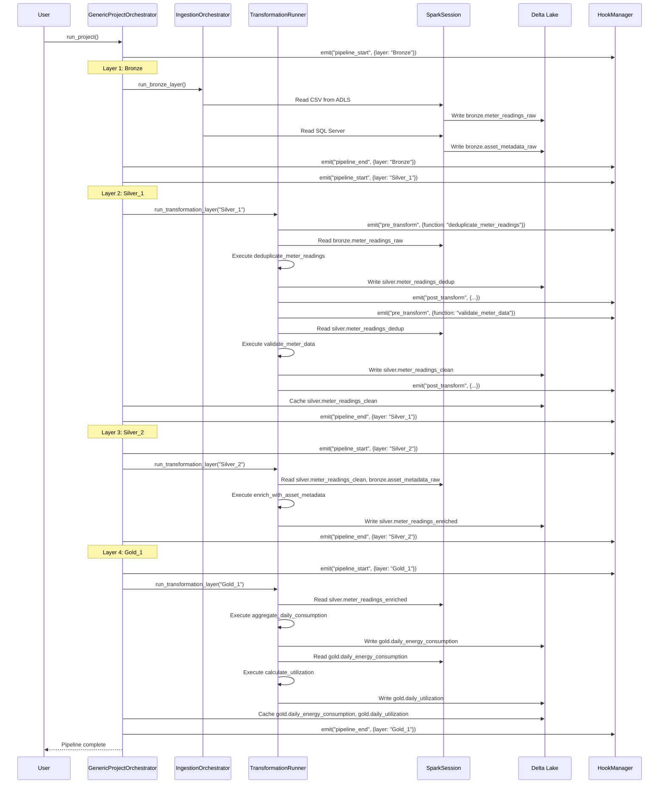
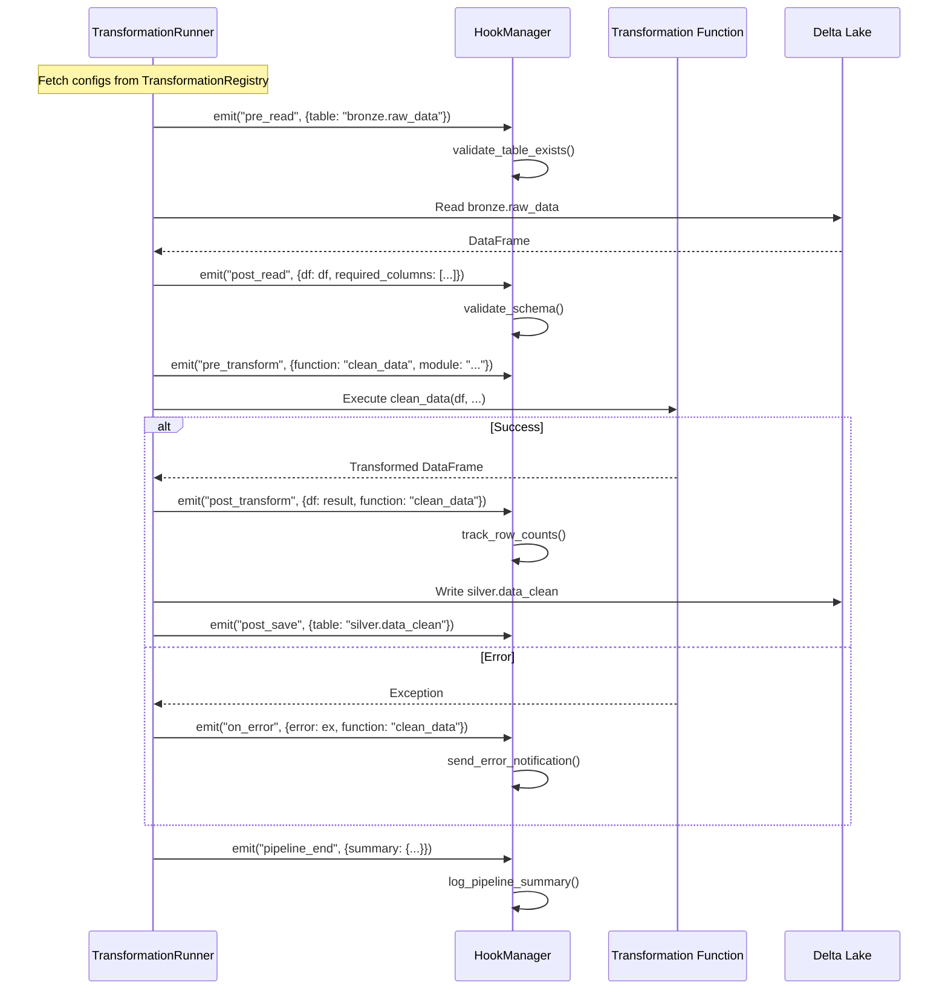

# Dataflow Examples - Step-by-Step Walkthroughs

## Table of Contents
- [Complete Pipeline: Ingestion to Gold](#complete-pipeline-ingestion-to-gold)
- [Spark Workflow Example](#spark-workflow-example)
- [Pandas Workflow Example](#pandas-workflow-example)
- [Hook Event Flow](#hook-event-flow)
- [Mixed-Engine Pipeline](#mixed-engine-pipeline)

---

## Complete Pipeline: Ingestion to Gold

### Scenario

Energy consumption data pipeline with Bronze → Silver → Gold medallion architecture.

**Data Sources**:
- CSV files in Azure Blob Storage (meter readings)
- SQL Server (asset metadata)

**Layers**:
- **Bronze**: Raw ingestion
- **Silver_1**: Data quality (deduplication, type casting)
- **Silver_2**: Enrichment (join with asset metadata)
- **Gold_1**: Aggregations (daily/monthly KPIs)

### Step 1: Project Setup

**1.1 Create manifest.json**

```json
{
  "project_name": "Energy Efficiency",
  "project_type": "analytics",
  "description": "Energy consumption analytics pipeline",
  "version": "1.0.0",
  
  "layer_order": ["Bronze", "Silver_1", "Silver_2", "Gold_1"],
  
  "layers": {
    "Bronze": {
      "name": "Bronze",
      "description": "Raw ingestion from sources",
      "depends_on": [],
      "max_workers": 4
    },
    "Silver_1": {
      "name": "Silver_1",
      "description": "Data quality and validation",
      "depends_on": ["Bronze"],
      "cache_tables": ["silver.meter_readings_clean"],
      "max_workers": 8
    },
    "Silver_2": {
      "name": "Silver_2",
      "description": "Data enrichment",
      "depends_on": ["Silver_1"],
      "max_workers": 8
    },
    "Gold_1": {
      "name": "Gold_1",
      "description": "Aggregations and KPIs",
      "depends_on": ["Silver_2"],
      "cache_tables": ["gold.daily_energy_consumption"]
    }
  },
  
  "cache_plan": {
    "Silver_1": ["silver.meter_readings_clean"],
    "Gold_1": ["gold.daily_energy_consumption", "gold.monthly_kpis"]
  },
  
  "entity_labels": {
    "entity_1": "plant",
    "entity_2": "meter"
  },
  
  "environments": ["dev", "qat", "prod"],
  "default_env": "qat"
}
```

**1.2 Configure Ingestion Sources**

```sql
-- IngestionSourceConfig table
CREATE TABLE IngestionSourceConfig (
    ingestion_id STRING,
    project STRING,
    environment STRING,
    source_type STRING,
    source_path STRING,
    target_table STRING,
    schema_definition TEXT,
    enabled BOOLEAN
);

-- Insert meter readings source
INSERT INTO IngestionSourceConfig VALUES (
    'ING_METER_READINGS',
    'Energy Efficiency',
    'qat',
    'csv',
    'abfss://landing@mystorageaccount.dfs.core.windows.net/meter_readings/*.csv',
    'bronze.meter_readings_raw',
    '{"meter_id": "string", "timestamp": "timestamp", "consumption_kwh": "double"}',
    true
);

-- Insert asset metadata source
INSERT INTO IngestionSourceConfig VALUES (
    'ING_ASSET_METADATA',
    'Energy Efficiency',
    'qat',
    'sql',
    'SELECT * FROM dbo.AssetMetadata',
    'bronze.asset_metadata_raw',
    '{"asset_id": "string", "plant": "string", "capacity_kw": "double"}',
    true
);
```

### Step 2: Register Transformation Functions

**2.1 Silver_1: Data Quality Functions**

```python
# File: my_project/transformations/cleaning.py
from odibi_de_v2.odibi_functions import spark_function
from pyspark.sql import functions as F

@spark_function(
    module="transformations.cleaning",
    description="Remove duplicate meter readings",
    version="1.0"
)
def deduplicate_meter_readings(df, subset=None, context=None):
    """
    Remove duplicate rows based on meter_id and timestamp.
    Keep the latest reading by consumption_kwh.
    """
    if subset:
        return df.dropDuplicates(subset)
    return df.dropDuplicates(["meter_id", "timestamp"])


@spark_function(
    module="transformations.cleaning",
    description="Cast data types and validate ranges",
    version="1.0"
)
def validate_meter_data(df, context=None):
    """
    Validate meter readings:
    - consumption_kwh must be >= 0
    - timestamp must be within last 2 years
    """
    from datetime import datetime, timedelta
    
    two_years_ago = datetime.now() - timedelta(days=730)
    
    validated = df.filter(
        (F.col("consumption_kwh") >= 0) &
        (F.col("timestamp") >= F.lit(two_years_ago))
    )
    
    return validated
```

**2.2 Silver_2: Enrichment Functions**

```python
# File: my_project/transformations/enrichment.py
from odibi_de_v2.odibi_functions import spark_function

@spark_function(
    module="transformations.enrichment",
    description="Join meter readings with asset metadata",
    version="1.0"
)
def enrich_with_asset_metadata(meter_df, asset_df, context=None):
    """
    Join meter readings with asset metadata to add plant and capacity info.
    """
    enriched = meter_df.join(
        asset_df,
        meter_df.meter_id == asset_df.asset_id,
        "left"
    ).select(
        meter_df["*"],
        asset_df["plant"],
        asset_df["capacity_kw"]
    )
    
    return enriched
```

**2.3 Gold_1: Aggregation Functions**

```python
# File: my_project/transformations/aggregations.py
from odibi_de_v2.odibi_functions import spark_function
from pyspark.sql import functions as F

@spark_function(
    module="transformations.aggregations",
    description="Calculate daily energy consumption by plant",
    version="1.0"
)
def aggregate_daily_consumption(df, context=None):
    """
    Aggregate meter readings to daily consumption by plant.
    """
    daily = df.groupBy(
        F.to_date("timestamp").alias("date"),
        "plant"
    ).agg(
        F.sum("consumption_kwh").alias("total_consumption_kwh"),
        F.avg("consumption_kwh").alias("avg_consumption_kwh"),
        F.count("meter_id").alias("reading_count")
    )
    
    return daily


@spark_function(
    module="transformations.aggregations",
    description="Calculate utilization percentage vs capacity",
    version="1.0"
)
def calculate_utilization(df, context=None):
    """
    Calculate percentage of capacity utilization.
    """
    utilization = df.withColumn(
        "utilization_pct",
        (F.col("total_consumption_kwh") / F.col("capacity_kw")) * 100
    )
    
    return utilization
```

### Step 3: Configure TransformationRegistry

```sql
-- Create TransformationRegistry table
CREATE TABLE TransformationRegistry (
    transformation_id STRING,
    project STRING,
    environment STRING,
    layer STRING,
    entity_1 STRING,
    entity_2 STRING,
    module STRING,
    function STRING,
    inputs TEXT,
    constants TEXT,
    outputs TEXT,
    enabled BOOLEAN
);

-- Silver_1: Deduplication
INSERT INTO TransformationRegistry VALUES (
    'T_SILVER1_DEDUP',
    'Energy Efficiency',
    'qat',
    'Silver_1',
    'all_plants',
    'all_meters',
    'transformations.cleaning',
    'deduplicate_meter_readings',
    '["bronze.meter_readings_raw"]',
    '{"subset": ["meter_id", "timestamp"]}',
    '["silver.meter_readings_dedup"]',
    true
);

-- Silver_1: Validation
INSERT INTO TransformationRegistry VALUES (
    'T_SILVER1_VALIDATE',
    'Energy Efficiency',
    'qat',
    'Silver_1',
    'all_plants',
    'all_meters',
    'transformations.cleaning',
    'validate_meter_data',
    '["silver.meter_readings_dedup"]',
    '{}',
    '["silver.meter_readings_clean"]',
    true
);

-- Silver_2: Enrichment
INSERT INTO TransformationRegistry VALUES (
    'T_SILVER2_ENRICH',
    'Energy Efficiency',
    'qat',
    'Silver_2',
    'all_plants',
    'all_meters',
    'transformations.enrichment',
    'enrich_with_asset_metadata',
    '["silver.meter_readings_clean", "bronze.asset_metadata_raw"]',
    '{}',
    '["silver.meter_readings_enriched"]',
    true
);

-- Gold_1: Daily Aggregation
INSERT INTO TransformationRegistry VALUES (
    'T_GOLD1_DAILY',
    'Energy Efficiency',
    'qat',
    'Gold_1',
    'all_plants',
    'all_meters',
    'transformations.aggregations',
    'aggregate_daily_consumption',
    '["silver.meter_readings_enriched"]',
    '{}',
    '["gold.daily_energy_consumption"]',
    true
);

-- Gold_1: Utilization Calculation
INSERT INTO TransformationRegistry VALUES (
    'T_GOLD1_UTILIZATION',
    'Energy Efficiency',
    'qat',
    'Gold_1',
    'all_plants',
    'all_meters',
    'transformations.aggregations',
    'calculate_utilization',
    '["gold.daily_energy_consumption"]',
    '{}',
    '["gold.daily_utilization"]',
    true
);
```

### Step 4: Execute Pipeline

```python
from odibi_de_v2.orchestration import GenericProjectOrchestrator
from odibi_de_v2.hooks import HookManager

# Setup hooks for monitoring
hooks = HookManager()

def log_start(payload):
    print(f"🚀 Starting layer: {payload['layer']}")

def log_transform(payload):
    print(f"⚙️  Executing: {payload['function']} (module: {payload['module']})")

def log_end(payload):
    print(f"✅ Completed layer: {payload['layer']} in {payload['duration']}s")

hooks.register("pipeline_start", log_start)
hooks.register("pre_transform", log_transform)
hooks.register("pipeline_end", log_end)

# Initialize orchestrator
orchestrator = GenericProjectOrchestrator(
    project="Energy Efficiency",
    env="qat",
    log_level="INFO",
    save_logs=True,
    engine="spark",
    hooks=hooks
)

# Run entire pipeline
orchestrator.run_project()
```

### Step 5: Execution Flow



---

## Spark Workflow Example

### Scenario

Real-time sensor data processing with Spark engine.

### Function Definition

```python
from odibi_de_v2.odibi_functions import spark_function
from pyspark.sql import functions as F

@spark_function(
    module="iot.processing",
    description="Aggregate sensor readings by 5-minute windows",
    version="1.0"
)
def aggregate_sensor_windows(df, window_minutes=5, context=None):
    """
    Aggregate sensor readings into time windows.
    
    Args:
        df: Spark DataFrame with columns [sensor_id, timestamp, temperature, humidity]
        window_minutes: Window size in minutes
        context: ExecutionContext (auto-injected)
    
    Returns:
        Spark DataFrame with windowed aggregations
    """
    from pyspark.sql.window import Window
    
    windowed = df.groupBy(
        F.window("timestamp", f"{window_minutes} minutes"),
        "sensor_id"
    ).agg(
        F.avg("temperature").alias("avg_temperature"),
        F.max("temperature").alias("max_temperature"),
        F.min("temperature").alias("min_temperature"),
        F.avg("humidity").alias("avg_humidity"),
        F.count("*").alias("reading_count")
    )
    
    # Flatten window struct
    result = windowed.select(
        F.col("window.start").alias("window_start"),
        F.col("window.end").alias("window_end"),
        "sensor_id",
        "avg_temperature",
        "max_temperature",
        "min_temperature",
        "avg_humidity",
        "reading_count"
    )
    
    return result
```

### TransformationRegistry Config

```json
{
  "transformation_id": "T_IOT_WINDOW_AGG",
  "project": "IoT Monitoring",
  "environment": "prod",
  "layer": "Silver_1",
  "module": "iot.processing",
  "function": "aggregate_sensor_windows",
  "inputs": ["bronze.sensor_readings"],
  "constants": {
    "window_minutes": 5,
    "engine": "spark"
  },
  "outputs": ["silver.sensor_windows"],
  "enabled": true
}
```

### Execution

```python
from odibi_de_v2.transformer import TransformationRunnerFromConfig

runner = TransformationRunnerFromConfig(
    sql_provider=my_sql_provider,
    project="IoT Monitoring",
    env="prod",
    layer="Silver_1",
    engine="spark",
    log_level="INFO"
)

runner.run()
```

**Console Output**:
```
[INFO] Fetching transformation configs for layer=Silver_1, project=IoT Monitoring, env=prod
[INFO] Found 1 transformation(s)
[INFO] Executing T_IOT_WINDOW_AGG: aggregate_sensor_windows
[INFO] Reading input table: bronze.sensor_readings
[INFO] Resolved function: aggregate_sensor_windows (engine=spark)
[INFO] Executing transformation...
[INFO] Writing output table: silver.sensor_windows
[INFO] ✅ Completed T_IOT_WINDOW_AGG in 12.3s
```

---

## Pandas Workflow Example

### Scenario

Small dataset processing with Pandas engine (local development).

### Function Definition

```python
from odibi_de_v2.odibi_functions import pandas_function
import pandas as pd
import numpy as np

@pandas_function(
    module="analytics.cleaning",
    description="Fill missing values and remove outliers",
    version="1.0"
)
def clean_sales_data(df, fill_strategy="mean", outlier_std=3, context=None):
    """
    Clean sales data:
    - Fill missing values with mean/median
    - Remove outliers beyond N standard deviations
    
    Args:
        df: Pandas DataFrame with columns [date, product, quantity, revenue]
        fill_strategy: "mean" or "median"
        outlier_std: Number of standard deviations for outlier detection
        context: ExecutionContext
    
    Returns:
        Pandas DataFrame (cleaned)
    """
    result = df.copy()
    
    # Fill missing values
    numeric_cols = result.select_dtypes(include=[np.number]).columns
    if fill_strategy == "mean":
        result[numeric_cols] = result[numeric_cols].fillna(result[numeric_cols].mean())
    elif fill_strategy == "median":
        result[numeric_cols] = result[numeric_cols].fillna(result[numeric_cols].median())
    
    # Remove outliers (Z-score method)
    for col in numeric_cols:
        mean = result[col].mean()
        std = result[col].std()
        result = result[
            (result[col] >= mean - outlier_std * std) &
            (result[col] <= mean + outlier_std * std)
        ]
    
    return result
```

### TransformationRegistry Config

```json
{
  "transformation_id": "T_SALES_CLEAN",
  "project": "Sales Analytics",
  "environment": "dev",
  "layer": "Silver",
  "module": "analytics.cleaning",
  "function": "clean_sales_data",
  "inputs": ["bronze.sales_raw"],
  "constants": {
    "fill_strategy": "median",
    "outlier_std": 3,
    "engine": "pandas"
  },
  "outputs": ["silver.sales_clean"],
  "enabled": true
}
```

### Execution

```python
from odibi_de_v2.transformer import TransformationRunnerFromConfig

runner = TransformationRunnerFromConfig(
    sql_provider=my_sql_provider,
    project="Sales Analytics",
    env="dev",
    layer="Silver",
    engine="pandas",  # Pandas mode
    log_level="INFO"
)

runner.run()
```

**Console Output**:
```
[INFO] Fetching transformation configs for layer=Silver, project=Sales Analytics, env=dev
[INFO] Found 1 transformation(s)
[INFO] Executing T_SALES_CLEAN: clean_sales_data
[INFO] Reading input table: bronze.sales_raw (pandas mode)
[INFO] Resolved function: clean_sales_data (engine=pandas)
[INFO] Executing transformation...
[INFO] Input shape: (10000, 4) → Output shape: (9823, 4)
[INFO] Writing output table: silver.sales_clean
[INFO] ✅ Completed T_SALES_CLEAN in 2.1s
```

---

## Hook Event Flow

### Scenario

Add custom validation and notification hooks to pipeline.

### Hook Definitions

```python
from odibi_de_v2.hooks import HookManager

hooks = HookManager()

# 1. Pre-read validation: Check table exists
def validate_table_exists(payload):
    table = payload.get("table")
    if not table:
        raise ValueError("Table name missing in payload")
    
    # Check if table exists in Delta Lake
    try:
        spark.sql(f"DESCRIBE TABLE {table}")
    except Exception as e:
        raise ValueError(f"Table {table} does not exist: {e}")

hooks.register("pre_read", validate_table_exists)

# 2. Post-read validation: Check schema
def validate_schema(payload):
    df = payload.get("df")
    required_columns = payload.get("required_columns", [])
    
    actual_columns = set(df.columns)
    missing = set(required_columns) - actual_columns
    
    if missing:
        raise ValueError(f"Missing required columns: {sorted(missing)}")

hooks.register("post_read", validate_schema)

# 3. Post-transform monitoring: Track row counts
def track_row_counts(payload):
    df = payload.get("df")
    function = payload.get("function")
    
    if hasattr(df, 'count'):  # Spark
        row_count = df.count()
    else:  # Pandas
        row_count = len(df)
    
    print(f"📊 {function} produced {row_count:,} rows")

hooks.register("post_transform", track_row_counts)

# 4. On error: Send notification
def send_error_notification(payload):
    error = payload.get("error")
    function = payload.get("function")
    module = payload.get("module")
    
    # Send to monitoring system (e.g., Slack, email)
    print(f"❌ ERROR in {module}.{function}: {error}")
    # send_slack_alert(f"Pipeline failed: {error}")

hooks.register("on_error", send_error_notification)

# 5. Pipeline end: Log summary
def log_pipeline_summary(payload):
    project = payload.get("project")
    layer = payload.get("layer")
    duration = payload.get("duration")
    summary = payload.get("summary", {})
    
    print(f"""
    ✅ Pipeline Complete
    Project: {project}
    Layer: {layer}
    Duration: {duration:.2f}s
    Transformations: {summary.get('total', 0)}
    Success: {summary.get('success', 0)}
    Failed: {summary.get('failed', 0)}
    """)

hooks.register("pipeline_end", log_pipeline_summary)
```

### Hook Execution Flow



### Hook Payload Examples

#### pre_read Event

```python
{
  "event": "pre_read",
  "table": "bronze.meter_readings",
  "source_type": "delta",
  "project": "Energy Efficiency",
  "env": "qat",
  "layer": "Bronze"
}
```

#### post_transform Event

```python
{
  "event": "post_transform",
  "function": "deduplicate_meter_readings",
  "module": "transformations.cleaning",
  "df": <DataFrame object>,
  "row_count": 125000,
  "duration": 8.2,
  "project": "Energy Efficiency",
  "layer": "Silver_1",
  "engine": "spark"
}
```

#### on_error Event

```python
{
  "event": "on_error",
  "error": "ValueError: Missing required columns: ['meter_id']",
  "function": "validate_meter_data",
  "module": "transformations.cleaning",
  "transformation_id": "T_SILVER1_VALIDATE",
  "project": "Energy Efficiency",
  "env": "qat",
  "layer": "Silver_1"
}
```

---

## Mixed-Engine Pipeline

### Scenario

Use Spark for heavy transformations and Pandas for lightweight operations.

### Configuration

```sql
-- Transformation 1: Spark (large dataset)
INSERT INTO TransformationRegistry VALUES (
    'T001',
    'Mixed Pipeline',
    'qat',
    'Silver',
    '',
    '',
    'transformations.spark_ops',
    'join_large_tables',
    '["bronze.orders", "bronze.customers"]',
    '{"engine": "spark"}',  -- Force Spark
    '["silver.orders_enriched"]',
    true
);

-- Transformation 2: Pandas (small dataset)
INSERT INTO TransformationRegistry VALUES (
    'T002',
    'Mixed Pipeline',
    'qat',
    'Silver',
    '',
    '',
    'transformations.pandas_ops',
    'calculate_statistics',
    '["silver.orders_enriched"]',
    '{"engine": "pandas"}',  -- Force Pandas
    '["silver.order_stats"]',
    true
);
```

### Execution

```python
from odibi_de_v2.orchestration import GenericProjectOrchestrator

orchestrator = GenericProjectOrchestrator(
    project="Mixed Pipeline",
    env="qat",
    engine="spark"  # Default is Spark
)

orchestrator.run_project()
```

**Execution Flow**:
1. T001 runs on **Spark** (per-transformation override via `constants.engine`)
2. T002 runs on **Pandas** (per-transformation override)
3. Framework automatically handles engine switching

---

## Summary

This guide demonstrated:

1. ✅ **Complete Bronze → Silver → Gold pipeline** with manifest-driven execution
2. ✅ **Spark-specific workflow** for large-scale data processing
3. ✅ **Pandas-specific workflow** for small dataset analytics
4. ✅ **Hook system** for validation, monitoring, and notifications
5. ✅ **Mixed-engine pipeline** with per-transformation engine overrides

---

## Next Steps

- **[03-EXTENDING_FRAMEWORK.md](03-EXTENDING_FRAMEWORK.md)**: How to add custom functions and transformations
- **[04-GLOSSARY.md](04-GLOSSARY.md)**: Complete reference of classes and configs
- **[ARCHITECTURE_MAP.md](ARCHITECTURE_MAP.md)**: Visual module dependency diagrams
