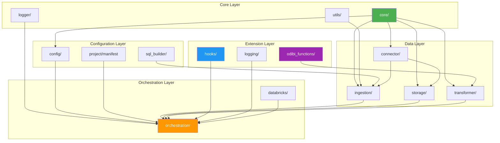
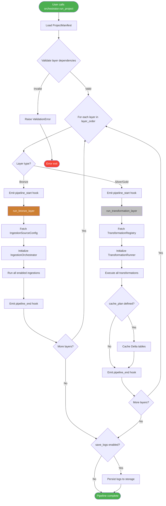
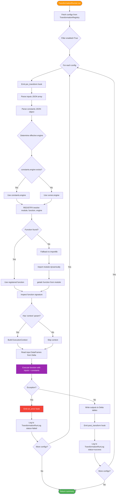
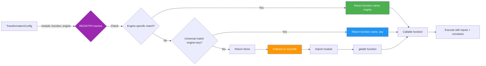
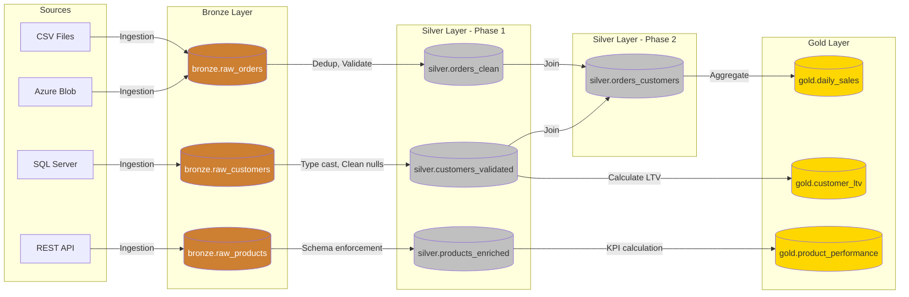
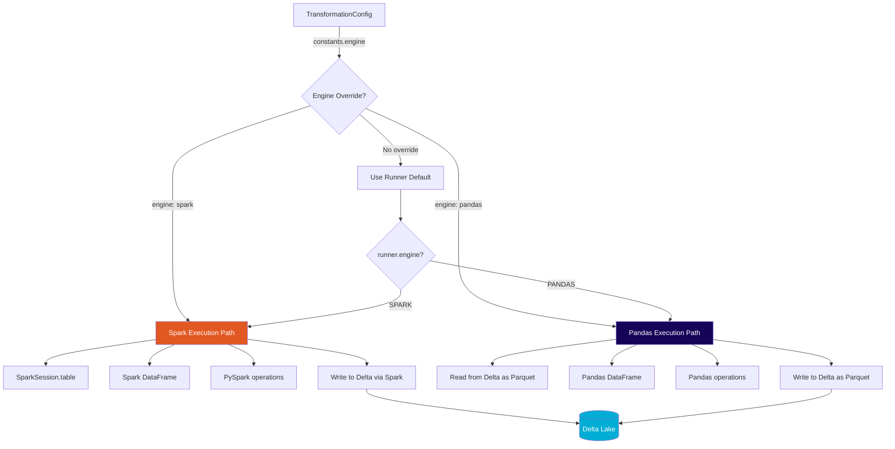
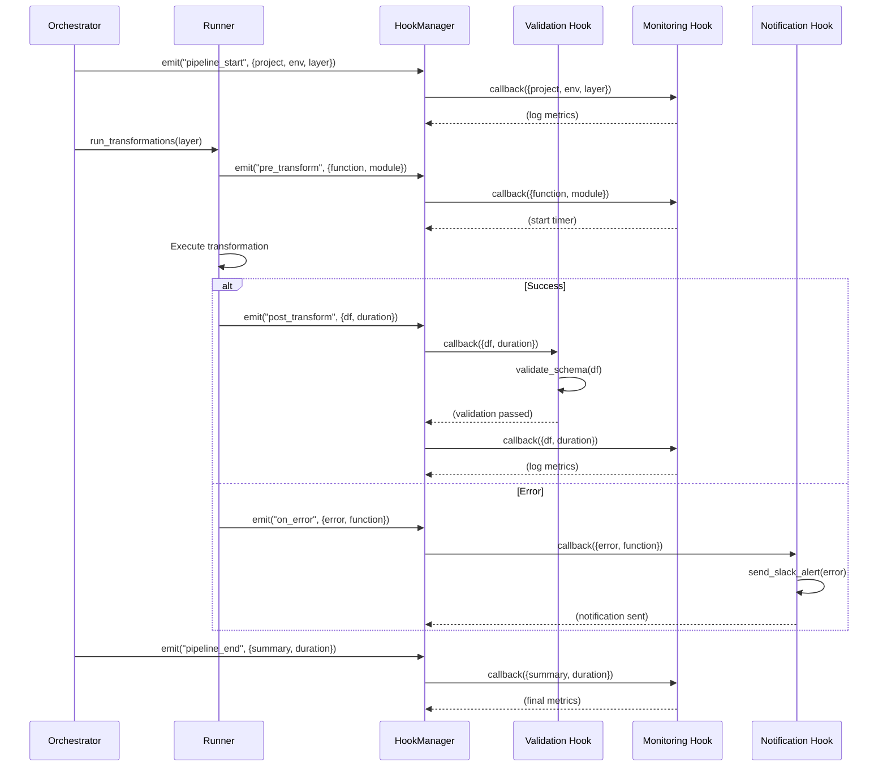

# Architecture Map - Visual Reference

## Table of Contents
- [Module Dependency Graph](#module-dependency-graph)
- [Package Structure](#package-structure)
- [Execution Flow Diagrams](#execution-flow-diagrams)
- [Data Flow Architecture](#data-flow-architecture)
- [Component Interaction Diagrams](#component-interaction-diagrams)

---

## Module Dependency Graph

### High-Level Module Dependencies



---

## Package Structure

### Complete Directory Tree

```
odibi_de_v2/
├── cli/                          # Command-line interface
│   └── commands.py
│
├── config/                       # Configuration management
│   ├── ingestion_config.py
│   ├── transformation_config.py
│   └── transformation_registry_ui.py
│
├── connector/                    # Data source connectors
│   ├── azure_blob_connection.py
│   ├── sql_connection.py
│   └── local_file_connection.py
│
├── core/                         # Core abstractions
│   ├── __init__.py
│   ├── engine.py                 # Engine enum, ExecutionContext
│   ├── data_reader.py            # IDataReader interface
│   ├── data_saver.py             # IDataSaver interface
│   ├── data_transformer.py       # IDataTransformer interface
│   └── types.py                  # DataType, ErrorType enums
│
├── databricks/                   # Databricks-specific utilities
│   ├── orchestration/
│   │   ├── base_orchestrator.py
│   │   └── delta_table_manager.py
│   └── storage/
│       └── function_registry.py
│
├── hooks/                        # Event-driven hooks
│   ├── __init__.py
│   └── manager.py                # HookManager class
│
├── ingestion/                    # Data ingestion (Bronze)
│   ├── pandas_reader.py
│   ├── spark_reader.py
│   ├── reader_factory.py
│   └── reader_provider.py
│
├── logger/                       # Legacy logging (being replaced)
│   ├── dynamic_logger.py
│   ├── metadata_manager.py
│   └── decorator.py
│
├── logging/                      # New pluggable logging
│   ├── __init__.py
│   ├── log_sink.py               # BaseLogSink, SparkDeltaLogSink
│   └── console_sink.py
│
├── odibi_functions/              # Function registry system
│   ├── __init__.py
│   ├── registry.py               # FunctionRegistry singleton
│   ├── decorators.py             # @odibi_function, @spark_function
│   ├── context.py                # ExecutionContext helpers
│   └── examples.py               # Example functions
│
├── orchestration/                # Pipeline orchestration
│   ├── __init__.py
│   └── generic_orchestrator.py   # GenericProjectOrchestrator
│
├── pandas_utils/                 # Pandas-specific utilities
│   └── helpers.py
│
├── project/                      # Project manifest system
│   ├── __init__.py
│   └── manifest.py               # ProjectManifest, LayerConfig
│
├── spark_utils/                  # Spark-specific utilities
│   └── helpers.py
│
├── sql_builder/                  # Dynamic SQL generation
│   └── query_builder.py
│
├── storage/                      # Data saving (Delta, Parquet)
│   ├── pandas_saver.py
│   ├── spark_saver.py
│   ├── saver_factory.py
│   └── saver_provider.py
│
├── transformer/                  # Transformation logic
│   ├── transformation_runner_from_config.py  # TransformationRunnerFromConfig
│   ├── transformer_orchestrator.py
│   ├── transformer_function_registry.py
│   └── [transformation classes]
│
├── utils/                        # General utilities
│   ├── __init__.py
│   ├── thread_pool.py
│   └── validation.py
│
└── __init__.py
```

---

## Execution Flow Diagrams

### 1. Complete Pipeline Execution



### 2. Transformation Execution Flow



### 3. Function Resolution Flow



---

## Data Flow Architecture

### Bronze → Silver → Gold Flow



### Dual-Engine Data Processing



---

## Component Interaction Diagrams

### 1. Orchestrator → Runner → Registry Interaction

```
┌─────────────────────────────────────────────────────────────┐
│                  GenericProjectOrchestrator                 │
│  - Load manifest.json                                       │
│  - Determine layer execution order                          │
│  - Manage hooks and logging                                 │
└─────────────────────────┬───────────────────────────────────┘
                          │
                          │ Initialize per layer
                          ↓
┌─────────────────────────────────────────────────────────────┐
│              TransformationRunnerFromConfig                 │
│  - Fetch TransformationRegistry configs                     │
│  - Execute transformations in parallel                      │
│  - Emit lifecycle hooks                                     │
└─────────────────────────┬───────────────────────────────────┘
                          │
                          │ Resolve function
                          ↓
┌─────────────────────────────────────────────────────────────┐
│                    FunctionRegistry                         │
│  - Singleton registry                                       │
│  - Engine-specific function resolution                      │
│  - Metadata management                                      │
└─────────────────────────┬───────────────────────────────────┘
                          │
                          │ Return callable
                          ↓
┌─────────────────────────────────────────────────────────────┐
│              Transformation Function                        │
│  @spark_function or @pandas_function                        │
│  - Receives inputs (DataFrames)                             │
│  - Receives constants (parameters)                          │
│  - Optionally receives ExecutionContext                     │
│  - Returns transformed DataFrame                            │
└─────────────────────────────────────────────────────────────┘
```

### 2. Hook Event Flow



### 3. Dual-Engine Context Injection

```
┌────────────────────────────────────────────────────────────┐
│          TransformationRunnerFromConfig                    │
│                                                            │
│  1. Determine effective_engine = cfg.get("constants",     │
│     {}).get("engine", self.engine.value)                  │
│                                                            │
│  2. Build ExecutionContext:                                │
│     ┌──────────────────────────────────────────┐          │
│     │  context = ExecutionContext(             │          │
│     │      engine=Engine[effective_engine],    │          │
│     │      project=cfg['project'],             │          │
│     │      env=cfg.get('env', self.env),       │          │
│     │      spark=self.spark,                   │          │
│     │      sql_provider=self.sql_provider,     │          │
│     │      logger=self.logger,                 │          │
│     │      hooks=self.hooks,                   │          │
│     │      extras={                            │          │
│     │          "plant": cfg.get('entity_1'),   │          │
│     │          "asset": cfg.get('entity_2'),   │          │
│     │          "layer": self.layer             │          │
│     │      }                                    │          │
│     │  )                                        │          │
│     └──────────────────────────────────────────┘          │
│                                                            │
│  3. Inspect function signature:                            │
│     if 'context' in inspect.signature(func).parameters:   │
│         func_kwargs['context'] = context                  │
│                                                            │
│  4. Execute:                                               │
│     result = func(**inputs, **constants, **func_kwargs)   │
└────────────────────────────────────────────────────────────┘
                           │
                           ↓
┌────────────────────────────────────────────────────────────┐
│       Transformation Function (with context)               │
│                                                            │
│  @spark_function(module="my_module")                       │
│  def my_transformation(df, param1, context=None):          │
│      if context:                                           │
│          # Access context.spark                            │
│          # Access context.logger                           │
│          # Access context.hooks                            │
│          # Access context.extras["plant"]                  │
│      return transformed_df                                 │
└────────────────────────────────────────────────────────────┘
```

---

## Component Responsibility Matrix

| Component | Responsibilities | Dependencies |
|-----------|-----------------|--------------|
| **GenericProjectOrchestrator** | - Load project manifest<br>- Execute layer sequence<br>- Manage caching<br>- Coordinate hooks | ProjectManifest, TransformationRunnerFromConfig, DeltaTableManager, HookManager |
| **TransformationRunnerFromConfig** | - Fetch transformation configs<br>- Resolve functions<br>- Execute transformations<br>- Log results | FunctionRegistry, ExecutionContext, BaseLogSink, HookManager |
| **FunctionRegistry** | - Store registered functions<br>- Resolve by (name, engine)<br>- Manage metadata | None (singleton) |
| **HookManager** | - Register event callbacks<br>- Emit events with payloads<br>- Filter by project/layer/engine | None |
| **ProjectManifest** | - Define project structure<br>- Validate layer dependencies<br>- Serialize/deserialize JSON | LayerConfig, ProjectType |
| **ExecutionContext** | - Encapsulate runtime state<br>- Provide access to resources | Engine, HookManager, Logger |
| **BaseLogSink** | - Abstract logging interface<br>- Write log records | None (interface) |
| **DeltaTableManager** | - Cache Delta tables<br>- Optimize tables<br>- Vacuum old files | SparkSession, Delta Lake |

---

## Layered Architecture View

```
┌─────────────────────────────────────────────────────────────┐
│                    Presentation Layer                       │
│                  (CLI, Notebooks, APIs)                     │
└───────────────────────┬─────────────────────────────────────┘
                        │
┌───────────────────────▼─────────────────────────────────────┐
│                  Orchestration Layer                        │
│  GenericProjectOrchestrator, ProjectManifest                │
└───────────────────────┬─────────────────────────────────────┘
                        │
┌───────────────────────▼─────────────────────────────────────┐
│                   Execution Layer                           │
│  TransformationRunnerFromConfig, IngestionOrchestrator      │
└───────────────────────┬─────────────────────────────────────┘
                        │
        ┌───────────────┼───────────────┐
        │               │               │
┌───────▼─────┐ ┌───────▼─────┐ ┌──────▼──────┐
│  Function   │ │    Hook     │ │   Logging   │
│  Registry   │ │   Manager   │ │    Sinks    │
└───────┬─────┘ └─────────────┘ └─────────────┘
        │
┌───────▼─────────────────────────────────────────────────────┐
│                    Data Access Layer                        │
│  Readers (Spark, Pandas) | Savers (Delta, Parquet)          │
└───────────────────────┬─────────────────────────────────────┘
                        │
┌───────────────────────▼─────────────────────────────────────┐
│                   Storage Layer                             │
│  Delta Lake, Parquet, CSV, Azure Blob Storage               │
└─────────────────────────────────────────────────────────────┘
```

---

## Summary

This architecture map provides:

1. ✅ **Module dependency graph**: Understand how packages relate to each other
2. ✅ **Package structure**: Complete directory tree with file purposes
3. ✅ **Execution flow diagrams**: Visual step-by-step pipeline execution
4. ✅ **Data flow architecture**: Bronze → Silver → Gold medallion pattern
5. ✅ **Component interaction diagrams**: How classes collaborate
6. ✅ **Responsibility matrix**: What each component owns
7. ✅ **Layered architecture view**: Abstraction layers from presentation to storage

---

## Next Steps

- **[00-SYSTEM_OVERVIEW.md](00-SYSTEM_OVERVIEW.md)**: High-level architecture overview
- **[01-CORE_COMPONENTS.md](01-CORE_COMPONENTS.md)**: Detailed component breakdown
- **[02-DATAFLOW_EXAMPLES.md](02-DATAFLOW_EXAMPLES.md)**: Step-by-step examples
- **[03-EXTENDING_FRAMEWORK.md](03-EXTENDING_FRAMEWORK.md)**: Developer guide
- **[04-GLOSSARY.md](04-GLOSSARY.md)**: Complete reference
