# Learning ODIBI DE v2: Your Introduction to Config-Driven Data Engineering

**Estimated Reading Time:** 20 minutes  
**Difficulty:** Beginner  
**Prerequisites:** Python basics, familiarity with DataFrames (Pandas or Spark)

---

## Welcome! 👋

If you've ever built data pipelines, you've probably experienced this:
- Writing the same ingestion code over and over for different data sources
- Copy-pasting transformation logic across similar datasets
- Hardcoding business rules that change frequently
- Spending more time debugging orchestration than solving business problems

**odibi_de_v2** is designed to solve these pain points. It's a production-grade framework that turns your data pipeline into a *configuration problem* rather than a *coding problem*.

---

## What is odibi_de_v2?

**odibi_de_v2** is a **config-driven data engineering framework** for building scalable, maintainable data pipelines on Spark and Pandas.

### The Core Idea

Instead of writing code for every new pipeline, you:
1. **Define** your data sources and transformations in configuration tables
2. **Register** reusable transformation functions once
3. **Execute** any pipeline with a single command: `orchestrator.run_project()`

Think of it like this:
- **Traditional approach**: You're a chef who writes a new recipe from scratch for every meal
- **odibi_de_v2 approach**: You're a chef with a recipe book (configuration) and a set of cooking techniques (registered functions) — you just pick the recipe and ingredients, and the framework handles the cooking

---

## Why Does odibi_de_v2 Exist?

### The Data Engineering Pain Points

Real-world data teams face recurring challenges:

**🔧 Problem 1: Repetitive Code**
```python
# You write this for CSV files...
df_csv = spark.read.csv("path/to/file.csv")
df_csv.write.format("delta").save("bronze/table")

# Then repeat it for JSON...
df_json = spark.read.json("path/to/file.json")
df_json.write.format("delta").save("bronze/table2")

# Then for SQL databases, APIs, Parquet...
```

**✅ odibi_de_v2 Solution:**
```python
# Just add a row to IngestionSourceConfig table:
# ingestion_id | source_type | source_path         | target_table
# ING001       | csv         | path/to/file.csv    | bronze.table
# ING002       | json        | path/to/file.json   | bronze.table2
# ING003       | sql         | SELECT * FROM ...   | bronze.table3

# Framework reads the config and does all ingestion automatically
orchestrator.run_project()
```

**🔧 Problem 2: Hard-to-Change Logic**
When business requirements change (like "now deduplicate by customer_id AND date instead of just customer_id"), you have to:
- Find all the code files
- Update hardcoded logic
- Redeploy pipelines
- Risk breaking things

**✅ odibi_de_v2 Solution:**
Just update the configuration — no code changes needed.

**🔧 Problem 3: Switching Between Spark and Pandas**
You prototype on Pandas locally, then rewrite everything for Spark in production.

**✅ odibi_de_v2 Solution:**
Write functions once with dual-engine support — they work on both Pandas and Spark.

---

## The Medallion Architecture (Bronze → Silver → Gold)

odibi_de_v2 implements the **medallion architecture**, an industry-standard pattern for organizing data pipelines.

### The Three Layers

Imagine a manufacturing assembly line where raw materials go through stages of refinement:

```mermaid
graph LR
    A[🏭 Raw Materials] -->|Quality Check| B[🥉 Bronze: Raw Ingestion]
    B -->|Clean & Validate| C[🥈 Silver: Refined Data]
    C -->|Assemble & Package| D[🥇 Gold: Business Products]
    D --> E[📦 Final Products]
    
    style A fill:#e1f5ff
    style B fill:#cd7f32,color:#fff
    style C fill:#c0c0c0
    style D fill:#ffd700
    style E fill:#d4edda
```



#### 🥉 Bronze Layer: Raw Ingestion
**Purpose:** Get data into your data lake *as-is* with minimal processing

**What happens here:**
- Read from sources (CSV files, SQL databases, REST APIs, Azure Blob Storage)
- Minimal schema enforcement (just make sure it's readable)
- Store in Delta/Parquet format for downstream use

**Real-world analogy:** A warehouse receiving dock — you accept deliveries and log what arrived, but don't reorganize yet.

**Example:**
```python
# Bronze ingestion from CSV
Source: sales_data.csv (columns: date, product, amount, customer_id)
Output: bronze.raw_sales (same columns, stored as Delta table)
```

#### 🥈 Silver Layer: Data Quality & Cleaning
**Purpose:** Make data clean, consistent, and trustworthy

**What happens here:**
- **Deduplication** (remove duplicate records)
- **Type casting** (ensure dates are dates, numbers are numbers)
- **Validation** (check for nulls, enforce business rules)
- **Joins** (combine related datasets)
- **Standardization** (consistent formats, naming conventions)

**Real-world analogy:** A quality control department — you inspect products, remove defects, and prepare them for assembly.

**Example:**
```python
# Silver transformation: Clean sales data
Input: bronze.raw_sales
Operations:
  - Remove duplicates based on (customer_id, date)
  - Convert date strings to datetime type
  - Filter out records with null customer_id
  - Standardize product names (e.g., "iPhone" → "iphone")
Output: silver.sales_clean
```

#### 🥇 Gold Layer: Business Logic & Aggregations
**Purpose:** Create business-ready datasets for analytics, ML, and reporting

**What happens here:**
- **Aggregations** (daily sales totals, customer lifetime value)
- **KPIs** (key performance indicators)
- **Feature engineering** (for machine learning models)
- **Business-specific calculations** (profit margins, churn scores)

**Real-world analogy:** The finished product warehouse — everything is packaged, labeled, and ready to ship to customers.

**Example:**
```python
# Gold transformation: Business metrics
Input: silver.sales_clean
Operations:
  - Group by customer_id
  - Calculate total_revenue = SUM(amount)
  - Calculate purchase_count = COUNT(*)
  - Calculate avg_order_value = total_revenue / purchase_count
Output: gold.customer_metrics
```

---

## Spark vs Pandas Engines: A Simple Explanation

odibi_de_v2 supports two **execution engines** — think of them as two different types of vehicles for moving your data:

### 🚗 Pandas Engine
- **Use when:** Working with small-to-medium datasets (< 1GB), prototyping locally, or running on a single machine
- **Strengths:** Fast for small data, easy to debug, works on your laptop
- **Weaknesses:** Runs out of memory on large datasets

**Analogy:** A car — great for local trips, but can't carry massive cargo.

### 🚚 Spark Engine
- **Use when:** Working with large datasets (> 1GB), running in cloud/Databricks, or needing distributed processing
- **Strengths:** Scales to terabytes, parallelizes across multiple machines, production-grade
- **Weaknesses:** Slower startup, requires cluster infrastructure

**Analogy:** A fleet of trucks — can move massive amounts of data, but overkill for small tasks.

### Why This Matters

In odibi_de_v2, you can write transformation functions that work on **both engines**:

```python
from odibi_de_v2.odibi_functions import dual_engine_function

@dual_engine_function(module="analytics", description="Remove duplicates")
def remove_duplicates(df, context=None):
    # This function works on both Pandas DataFrames AND Spark DataFrames!
    return df.drop_duplicates(subset=["customer_id", "date"])
```

**Why it matters:**
- Prototype on Pandas locally with sample data
- Deploy to production on Spark without rewriting code
- Switch engines by changing a config parameter, not your codebase

---

## One Command to Rule Them All: `run_project()`

Here's the magic of odibi_de_v2 — once you've set up your configurations, running an entire multi-layer pipeline is this simple:

```python
from odibi_de_v2.orchestration import GenericProjectOrchestrator

# Create the orchestrator
orchestrator = GenericProjectOrchestrator(
    project="Energy Efficiency",  # Your project name
    env="qat",                     # Environment (qat, prod, dev)
    log_level="INFO"               # Logging verbosity
)

# Run the entire pipeline (Bronze → Silver → Gold)
orchestrator.run_project()
```

**What happens behind the scenes:**
1. Loads your project's `manifest.json` (defines layer order and dependencies)
2. Executes Bronze layer (ingests all data sources from `IngestionSourceConfig`)
3. Executes Silver layers (runs transformations from `TransformationRegistry`)
4. Executes Gold layers (runs business logic transformations)
5. Caches Delta tables as configured
6. Logs everything for monitoring and debugging

**Real-world example from Energy Efficiency project:**
This single command orchestrates:
- Ingesting weather data from 4 manufacturing plants (via CSV)
- Ingesting sensor data from 50+ dryers, boilers, and evaporators (via APIs and SQL)
- Cleaning and validating 100+ tables
- Calculating energy efficiency KPIs across plants
- Generating cross-plant aggregations

All without writing orchestration code — just configuration!

---

## Real-World Example: Energy Efficiency Pipeline

Let's see how the **Energy Efficiency** project (one of the real projects in this codebase) uses odibi_de_v2:

### The Business Problem
A manufacturing company has 4 plants with dozens of dryers, boilers, and evaporators. They need to:
- Track energy consumption across all assets
- Calculate efficiency metrics
- Compare performance across plants
- Identify optimization opportunities

### The odibi_de_v2 Solution

**1. Project Structure (manifest.json)**
```json
{
  "project_name": "Energy Efficiency",
  "layer_order": ["Bronze", "Silver_1", "Silver_2", "Gold_1", "Gold_2"],
  "environments": ["qat", "prod"]
}
```

**2. Data Flow**


**3. Configuration-Driven Execution**

No hardcoded pipelines — everything is configured:

```python
# IngestionSourceConfig (Bronze layer)
# Defines what data to ingest and where it goes
| ingestion_id | project            | source_type | source_path                    | target_table                |
|--------------|-------------------|-------------|--------------------------------|-----------------------------|
| ING001       | Energy Efficiency | csv         | weather/argo_weather.csv       | bronze.argo_weather         |
| ING002       | Energy Efficiency | sql         | SELECT * FROM sensor_readings  | bronze.dryer_sensors        |
| ING003       | Energy Efficiency | api         | https://api.eia.gov/energy     | bronze.energy_prices        |

# TransformationRegistry (Silver/Gold layers)
# Defines what transformations to run
| transformation_id | layer    | module              | function                | inputs                  | outputs                    |
|-------------------|----------|---------------------|-------------------------|-------------------------|----------------------------|
| T001              | Silver_1 | energy.transforms   | clean_dryer_data        | bronze.dryer_sensors    | silver.dryer_clean         |
| T002              | Silver_1 | energy.transforms   | deduplicate_sensors     | silver.dryer_clean      | silver.dryer_unique        |
| T003              | Gold_1   | energy.aggregations | calculate_plant_totals  | silver.dryer_unique     | gold.plant_energy_totals   |
```

**4. Run It**
```python
orchestrator = GenericProjectOrchestrator(
    project="Energy Efficiency",
    env="qat"
)
orchestrator.run_project()
```

Done! The framework handles all 5 layers, 100+ tables, and complex dependencies.

---

## What You'll Learn in This Guide Series

This is **Part 1** of a learning journey. Here's what's ahead:

### ✅ 01_Introduction.md (You Are Here)
- What is odibi_de_v2 and why it exists
- Medallion architecture basics
- Spark vs Pandas engines
- The power of `run_project()`

### 📚 02_Architecture_Deep_Dive.md (Next)
- **Detailed package breakdown:** What each module does and why
- **Data flow mechanics:** How data moves through the framework
- **Class and function reference:** The building blocks you'll use
- **Energy Efficiency case study:** Detailed walkthrough of a real project

### 🚀 Coming in Future Guides
- **03_Configuration_Mastery.md:** How to write IngestionSourceConfig and TransformationRegistry entries
- **04_Writing_Transformations.md:** Creating your own transformation functions with decorators
- **05_Hooks_and_Events.md:** Advanced workflows with the event system
- **06_Testing_and_Debugging.md:** Best practices for testing config-driven pipelines

---

## Reflection: Key Takeaways

Before moving on, make sure you understand these core concepts:

1. **Config-Driven Philosophy**: In odibi_de_v2, you define *what* to do in configuration tables, and the framework handles *how* to do it.

2. **Medallion Architecture**: Data flows through Bronze (raw) → Silver (clean) → Gold (business logic) layers, with each layer building on the previous one.

3. **Dual-Engine Support**: Write transformation functions once, run them on Pandas (for small data) or Spark (for big data) by changing a config parameter.

4. **One-Command Execution**: `orchestrator.run_project()` runs your entire multi-layer pipeline based on configuration.

5. **Real-World Impact**: The Energy Efficiency project shows how odibi_de_v2 can orchestrate complex, multi-source, multi-layer pipelines with minimal code.

---

## Quick Self-Check Questions

Test your understanding:

1. **What are the three layers of the medallion architecture, and what is the purpose of each?**
   <details>
   <summary>Answer</summary>
   - Bronze: Raw ingestion (get data as-is into data lake)
   - Silver: Data quality (clean, validate, deduplicate)
   - Gold: Business logic (aggregations, KPIs, analytics-ready datasets)
   </details>

2. **When would you use Pandas vs Spark as your execution engine?**
   <details>
   <summary>Answer</summary>
   - Pandas: Small-to-medium datasets (<1GB), local prototyping, single-machine processing
   - Spark: Large datasets (>1GB), cloud/Databricks, distributed processing needs
   </details>

3. **What are the two main configuration tables that drive odibi_de_v2 pipelines?**
   <details>
   <summary>Answer</summary>
   - IngestionSourceConfig: Defines data sources for Bronze layer
   - TransformationRegistry: Defines transformations for Silver/Gold layers
   </details>

4. **What does `orchestrator.run_project()` do?**
   <details>
   <summary>Answer</summary>
   It executes the entire data pipeline (all layers) based on the project's manifest.json and configuration tables, handling ingestion, transformations, caching, and logging automatically.
   </details>

---

## Next Steps

You now have a solid foundation in what odibi_de_v2 is and why it's valuable.

**Ready to dive deeper?** Head to [02_Architecture_Deep_Dive.md](02_Architecture_Deep_Dive.md) to learn:
- How the framework's packages are organized
- What classes and functions power each layer
- How data flows through the system end-to-end
- A detailed walkthrough of the Energy Efficiency project architecture

**Want hands-on practice first?** Check out:
- [QUICK_REFERENCE.md](../QUICK_REFERENCE.md) for code snippets
- [00-SYSTEM_OVERVIEW.md](../00-SYSTEM_OVERVIEW.md) for technical diagrams

---

## Glossary of Terms Used

| Term | Definition |
|------|------------|
| **Config-Driven** | Approach where pipeline behavior is controlled by configuration tables/files, not hardcoded logic |
| **Medallion Architecture** | Data pipeline pattern with Bronze (raw) → Silver (clean) → Gold (business) layers |
| **Execution Engine** | The underlying technology (Pandas or Spark) that processes DataFrames |
| **Orchestrator** | Component that coordinates and executes all pipeline layers in sequence |
| **Manifest** | JSON file (`manifest.json`) that defines project structure, layer order, and dependencies |
| **Delta Table** | Open-source storage format that supports ACID transactions (used for data lake storage) |
| **Transformation** | Any operation that modifies data (filtering, aggregation, joining, etc.) |
| **Ingestion** | The process of reading data from sources and loading it into the data lake |

---

**Happy Learning!** 🚀

Got questions or feedback? This framework is designed to make your data engineering life easier — the more you understand the "why" behind the design, the more powerful it becomes.
