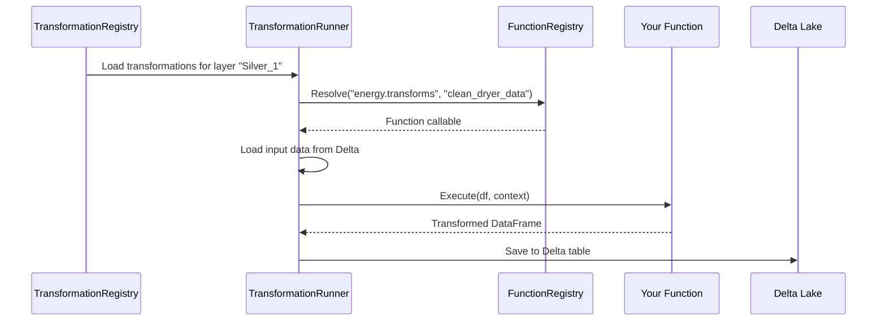
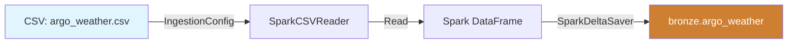
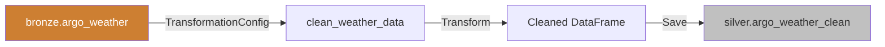
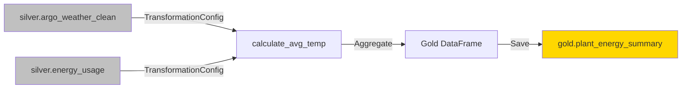
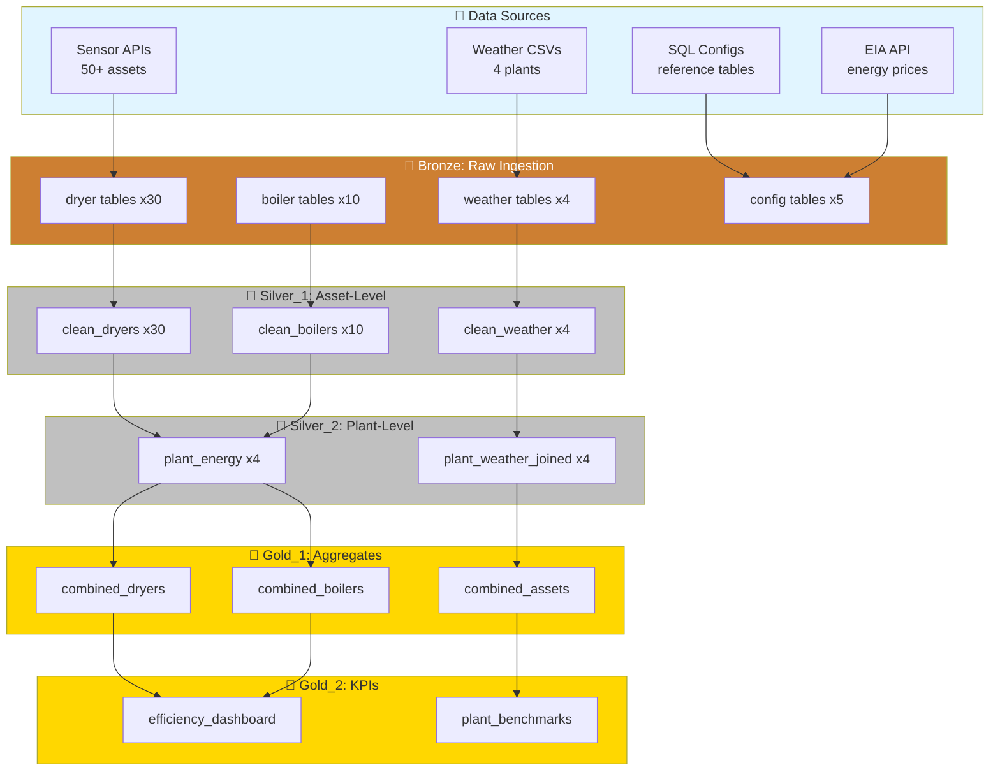
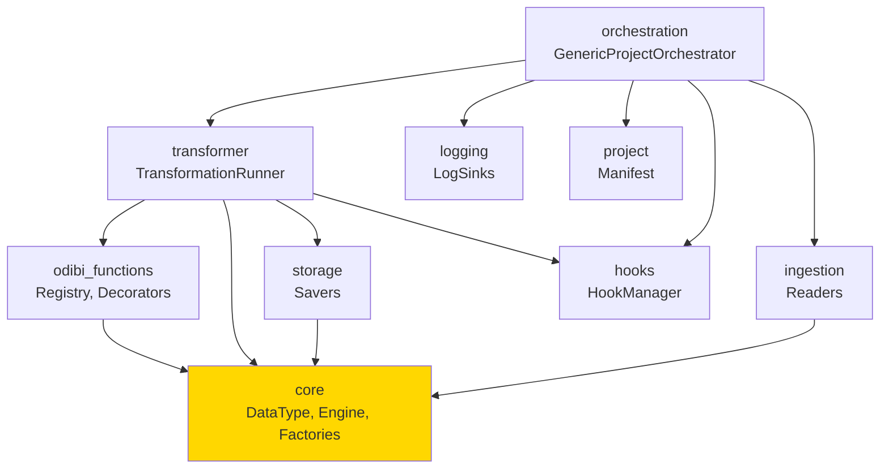

# Architecture Deep Dive: Inside the odibi_de_v2 Framework

**Estimated Reading Time:** 25 minutes  
**Difficulty:** Intermediate  
**Prerequisites:** Read [01_Introduction.md](01_Introduction.md) first

---

## Overview

In the introduction, you learned *what* odibi_de_v2 does. Now we'll explore *how* it works under the hood.

This guide covers:
- **Package architecture:** What each module does and why
- **Core classes and their responsibilities**
- **Data flow mechanics:** How data moves through the system
- **Energy Efficiency case study:** Real-world implementation

Think of this as the "engineering manual" that shows you the framework's internal machinery.

---

## The Framework's Package Structure

odibi_de_v2 is organized into 11 core packages. Each package has a specific responsibility in the data engineering workflow.

```
odibi_de_v2/
├── core/              # Foundation: DataTypes, Engines, Factories
├── ingestion/         # Bronze layer: Read data from sources
├── transformer/       # Silver/Gold: Transform data
├── orchestration/     # Coordinate multi-layer pipelines
├── project/           # Manage manifests and scaffolding
├── odibi_functions/   # Function registry and decorators
├── hooks/             # Event-driven callbacks
├── logging/           # Structured logging with sinks
├── storage/           # Save data to Delta/Parquet/CSV
├── databricks/        # Spark-specific utilities
├── sql_builder/       # Dynamic SQL query generation
└── utils/             # Helper functions and decorators
```

Let's explore each package in detail.

---

## Package 1: `core` — The Foundation

**Purpose:** Defines the fundamental building blocks that all other packages use.

### Key Components

#### 1. **Enums** (`core/enums.py`)

Standardized constants for type safety across the framework.

```python
from odibi_de_v2.core import DataType, Engine, ErrorType

# DataType: Supported file formats
class DataType(Enum):
    CSV = 'csv'
    JSON = 'json'
    PARQUET = 'parquet'
    DELTA = 'delta'
    SQL = 'sql'
    API = 'api'

# Engine: Execution engines
class Engine(Enum):
    SPARK = "spark"
    PANDAS = "pandas"

# ErrorType: Standardized error labels
class ErrorType(Enum):
    VALUE_ERROR = "VALUE_ERROR"
    FILE_NOT_FOUND = "FILE_NOT_FOUND"
    CONFIG_ERROR = "CONFIG_ERROR"
    VALIDATION_ERROR = "VALIDATION_ERROR"
    # ... and 10 more
```

**Why it matters:** Using enums instead of strings prevents typos and provides autocomplete in your IDE.

#### 2. **Reader Factory** (`core/reader_factory.py`)

Creates the right reader for any data source type.

```python
from odibi_de_v2.core import ReaderFactory, DataType

# Automatically creates the right reader based on DataType
reader = ReaderFactory.create_reader(
    data_type=DataType.CSV,
    engine=Engine.SPARK
)
# Returns: SparkCSVReader instance

reader = ReaderFactory.create_reader(
    data_type=DataType.SQL,
    engine=Engine.PANDAS
)
# Returns: PandasSQLReader instance
```

**Design Pattern:** Factory pattern — you don't need to know which concrete class to instantiate, the factory handles it.

#### 3. **Saver Factory** (`core/saver_factory.py`)

Creates the right saver for any output format.

```python
from odibi_de_v2.core import SaverFactory, DataType

# Create Delta table saver
saver = SaverFactory.create_saver(
    data_type=DataType.DELTA,
    engine=Engine.SPARK
)
# Returns: SparkDeltaSaver instance
```

### Core Package Summary

| Component | Purpose | Example Use |
|-----------|---------|-------------|
| `DataType` enum | Define supported formats | `DataType.DELTA`, `DataType.CSV` |
| `Engine` enum | Define execution engines | `Engine.SPARK`, `Engine.PANDAS` |
| `ErrorType` enum | Standardize error types | `ErrorType.CONFIG_ERROR` |
| `ReaderFactory` | Create readers dynamically | `ReaderFactory.create_reader(DataType.CSV, Engine.SPARK)` |
| `SaverFactory` | Create savers dynamically | `SaverFactory.create_saver(DataType.DELTA, Engine.SPARK)` |

**Why it matters:** The core package ensures consistency — every component speaks the same language when referring to data types, engines, and errors.

---

## Package 2: `ingestion` — Bronze Layer Data Reading

**Purpose:** Read data from external sources and load it into the Bronze layer.

### Architecture

```
ingestion/
├── providers/           # Reader provider system
│   ├── pandas_reader_provider.py   # Pandas-based readers
│   └── spark_reader_provider.py    # Spark-based readers
├── readers/             # Concrete reader implementations
│   ├── csv_reader.py
│   ├── json_reader.py
│   ├── sql_reader.py
│   ├── api_reader.py
│   └── delta_reader.py
└── __init__.py
```

### How It Works

**1. Provider Pattern:**
The framework uses *providers* to get the right reader:

```python
from odibi_de_v2.ingestion import SparkReaderProvider, DataType

provider = SparkReaderProvider()
reader = provider.get_reader(DataType.CSV)
# Returns: SparkCSVReader instance
```

**2. Reading Data:**

```python
# Example: Reading CSV with Spark
from odibi_de_v2.ingestion import SparkCSVReader
from odibi_de_v2.connector import AzureBlobConnection

# Setup connection to Azure
connector = AzureBlobConnection(
    account_name="mystorageaccount",
    account_key="secret_key"
)

# Create reader
reader = SparkCSVReader(connector=connector)

# Read data
df = reader.read(
    file_path="bronze/energy_data.csv",
    schema={"timestamp": "datetime", "value": "float"}
)
```

### Real Example from Energy Efficiency

The Energy Efficiency project ingests weather data for 4 plants:

```python
# Configuration in IngestionSourceConfig table:
| ingestion_id | source_type | source_path                          | target_table         |
|--------------|-------------|--------------------------------------|----------------------|
| ING001       | csv         | weather/argo_weather.csv             | bronze.argo_weather  |
| ING002       | csv         | weather/cedar_rapids_weather.csv     | bronze.cr_weather    |
| ING003       | csv         | weather/winston_salem_weather.csv    | bronze.ws_weather    |
| ING004       | csv         | weather/nkc_weather.csv              | bronze.nkc_weather   |

# Framework automatically:
# 1. Reads the config table
# 2. Creates SparkCSVReader for each row
# 3. Reads the data
# 4. Saves to bronze.* Delta tables
```

### Ingestion Package Summary

| Component | Purpose | Example |
|-----------|---------|---------|
| `SparkReaderProvider` | Get Spark-based readers | `provider.get_reader(DataType.CSV)` |
| `PandasReaderProvider` | Get Pandas-based readers | `provider.get_reader(DataType.JSON)` |
| `SparkCSVReader` | Read CSV files with Spark | `reader.read("data.csv")` |
| `SparkSQLReader` | Query SQL databases with Spark | `reader.read("SELECT * FROM table")` |
| `APIReader` | Fetch data from REST APIs | `reader.read("https://api.example.com")` |

**Why it matters:** You never write custom ingestion code. Just define the source in `IngestionSourceConfig`, and the framework handles it.

---

## Package 3: `transformer` — Silver/Gold Layer Processing

**Purpose:** Execute transformations on data to move from Bronze → Silver → Gold.

### Architecture

```
transformer/
├── transformation_runner_from_config.py  # Main orchestrator
├── transformer_function_registry.py      # Function lookup system
├── pandas/                               # Pandas-specific transformers
├── spark/                                # Spark-specific transformers
└── visualization/                        # DAG visualization tools
```

### Key Component: TransformationRunnerFromConfig

This is the *heart* of the transformation system. It:
1. Reads `TransformationRegistry` table (your config)
2. Resolves function names to actual Python callables
3. Executes transformations in order
4. Passes data between transformations
5. Saves results to Delta tables

**Workflow:**



### Example: Transformation Configuration

```python
# TransformationRegistry table entry:
{
  "transformation_id": "T001",
  "project": "Energy Efficiency",
  "environment": "qat",
  "layer": "Silver_1",
  "module": "energy.transformations",      # Where the function lives
  "function": "clean_dryer_data",          # Function name
  "inputs": ["bronze.dryer_raw"],          # Input tables
  "constants": {                            # Parameters passed to function
    "dedup_columns": ["asset_id", "timestamp"],
    "engine": "spark"
  },
  "outputs": ["silver.dryer_clean"],       # Output table
  "enabled": true
}
```

**The function being called:**

```python
# In energy/transformations.py
from odibi_de_v2.odibi_functions import spark_function

@spark_function(module="energy", description="Clean dryer sensor data")
def clean_dryer_data(df, dedup_columns, context=None):
    """
    Clean and validate dryer sensor data.
    
    Args:
        df: Spark/Pandas DataFrame
        dedup_columns: List of columns for deduplication
        context: ExecutionContext (optional)
    
    Returns:
        Cleaned DataFrame
    """
    # Remove duplicates
    df_clean = df.drop_duplicates(subset=dedup_columns)
    
    # Filter out null values
    df_clean = df_clean.filter(df_clean["value"].isNotNull())
    
    # Type casting
    df_clean = df_clean.withColumn("timestamp", df_clean["timestamp"].cast("timestamp"))
    
    return df_clean
```

**Running it:**

```python
from odibi_de_v2.transformer import TransformationRunnerFromConfig

runner = TransformationRunnerFromConfig(
    project="Energy Efficiency",
    env="qat",
    layer="Silver_1",
    spark=spark_session,
    engine="spark"
)

# Reads TransformationRegistry, executes all transformations for Silver_1
runner.run()
```

### Transformer Package Summary

| Component | Purpose | Example |
|-----------|---------|---------|
| `TransformationRunnerFromConfig` | Execute config-driven transformations | `runner.run()` |
| `FunctionRegistry` | Lookup registered functions | `registry.get("module", "function", "spark")` |
| `spark_function` decorator | Register Spark functions | `@spark_function(module="analytics")` |
| `pandas_function` decorator | Register Pandas functions | `@pandas_function(module="analytics")` |
| `dual_engine_function` decorator | Register engine-agnostic functions | `@dual_engine_function(module="analytics")` |

**Why it matters:** You define transformations once (as Python functions), register them, and then *configure* how they're used in pipelines — no hardcoding required.

---

## Package 4: `orchestration` — Multi-Layer Pipeline Coordination

**Purpose:** Coordinate the execution of Bronze → Silver → Gold layers in the correct order.

### Key Component: GenericProjectOrchestrator

The orchestrator is the "conductor" that runs the entire symphony.

**What it does:**
1. Loads project `manifest.json`
2. Determines layer execution order (respects dependencies)
3. Runs Bronze ingestion
4. Runs Silver/Gold transformations layer-by-layer
5. Caches Delta tables (if configured)
6. Emits events via hooks system

**Example Usage:**

```python
from odibi_de_v2.orchestration import GenericProjectOrchestrator

orchestrator = GenericProjectOrchestrator(
    project="Energy Efficiency",
    env="qat",
    log_level="INFO",
    save_logs=True,
    engine="spark"
)

# This runs the entire pipeline:
# Bronze → Silver_1 → Silver_2 → Gold_1 → Gold_2
orchestrator.run_project()
```

**What happens internally:**

```python
# Simplified version of what run_project() does:
def run_project(self):
    # 1. Load manifest
    manifest = ProjectManifest.load(self.project)
    
    # 2. Execute layers in order
    for layer in manifest.layer_order:
        logger.info(f"Executing layer: {layer}")
        
        # 3. Run transformations for this layer
        runner = TransformationRunnerFromConfig(
            project=self.project,
            env=self.env,
            layer=layer,
            spark=self.spark,
            engine=self.engine
        )
        runner.run()
        
        # 4. Cache tables if configured
        if layer in manifest.cache_plan:
            for table in manifest.cache_plan[layer]:
                self.delta_manager.cache_table(table)
    
    # 5. Save logs if enabled
    if self.save_logs:
        self.logger.save_to_storage()
```

### Orchestration Package Summary

| Component | Purpose | Example |
|-----------|---------|---------|
| `GenericProjectOrchestrator` | Run multi-layer pipelines | `orchestrator.run_project()` |
| `BaseProjectOrchestrator` | Abstract base for custom orchestrators | Extend for custom logic |

**Why it matters:** One command (`run_project()`) executes your entire data pipeline, no matter how complex.

---

## Package 5: `project` — Manifest Management

**Purpose:** Define and validate project structure via `manifest.json`.

### Key Component: ProjectManifest

**What is manifest.json?**
It's a configuration file that defines:
- Layer order (Bronze → Silver_1 → Silver_2 → Gold_1, etc.)
- Layer dependencies (Silver_1 depends on Bronze)
- Cache strategy (which tables to cache after each layer)
- Project metadata (name, type, environments)

**Real Example from Energy Efficiency:**

```json
{
  "project_name": "Energy Efficiency",
  "project_type": "manufacturing",
  "layer_order": [
    "Bronze",
    "Silver_1",
    "Silver_2",
    "Gold_1",
    "Gold_2"
  ],
  "layers": {
    "Bronze": {
      "name": "Bronze",
      "description": "Raw data ingestion layer",
      "depends_on": [],
      "cache_tables": []
    },
    "Silver_1": {
      "name": "Silver_1",
      "description": "Asset-level transformations",
      "depends_on": ["Bronze"],
      "cache_tables": []
    },
    "Silver_2": {
      "name": "Silver_2",
      "description": "Plant-level transformations",
      "depends_on": ["Silver_1"],
      "cache_tables": []
    },
    "Gold_1": {
      "name": "Gold_1",
      "description": "Cross-plant aggregations",
      "depends_on": ["Silver_2"],
      "cache_tables": []
    },
    "Gold_2": {
      "name": "Gold_2",
      "description": "Business-level KPIs",
      "depends_on": ["Gold_1"],
      "cache_tables": ["qat_energy_efficiency.combined_dryers"]
    }
  },
  "environments": ["qat", "prod"],
  "default_env": "qat",
  "entity_labels": {
    "entity_1": "plant",
    "entity_2": "asset"
  },
  "cache_plan": {
    "Gold_1": ["qat_energy_efficiency.combined_dryers"]
  }
}
```

**Using the manifest:**

```python
from odibi_de_v2.project import ProjectManifest

# Load manifest
manifest = ProjectManifest.load_from_file("Energy Efficiency/manifest.json")

# Access properties
print(manifest.layer_order)
# Output: ["Bronze", "Silver_1", "Silver_2", "Gold_1", "Gold_2"]

print(manifest.layers["Silver_1"].depends_on)
# Output: ["Bronze"]

print(manifest.cache_plan["Gold_1"])
# Output: ["qat_energy_efficiency.combined_dryers"]
```

### Project Package Summary

| Component | Purpose | Example |
|-----------|---------|---------|
| `ProjectManifest` | Load and validate manifest.json | `manifest = ProjectManifest.load("project")` |
| `Scaffolding` | Generate project templates | `scaffolding.create_project("MyProject")` |

**Why it matters:** The manifest is the single source of truth for your project's structure. Change the layer order? Just edit the JSON — no code changes.

---

## Package 6: `odibi_functions` — Function Registry System

**Purpose:** Register, discover, and resolve transformation functions.

### How It Works

**1. Register functions with decorators:**

```python
from odibi_de_v2.odibi_functions import spark_function, pandas_function, dual_engine_function

# Spark-only function
@spark_function(module="analytics", description="Calculate customer LTV")
def calculate_customer_ltv(df, context=None):
    return df.groupBy("customer_id").agg({"revenue": "sum"})

# Pandas-only function
@pandas_function(module="analytics", description="Remove outliers")
def remove_outliers(df, column, threshold=3.0):
    mean = df[column].mean()
    std = df[column].std()
    return df[(df[column] >= mean - threshold*std) & (df[column] <= mean + threshold*std)]

# Works on both engines
@dual_engine_function(module="analytics", description="Filter nulls")
def filter_nulls(df, column, context=None):
    # This code works on both Pandas and Spark DataFrames
    return df.filter(df[column].isNotNull()) if hasattr(df, 'filter') else df[df[column].notna()]
```

**2. Registry resolves functions at runtime:**

```python
from odibi_de_v2.odibi_functions import REGISTRY

# Look up a function
func = REGISTRY.get(module="analytics", function="calculate_customer_ltv", engine="spark")
# Returns: The actual Python function

# Execute it
result = func(input_dataframe)
```

**3. TransformationRunner uses the registry:**

When you define a transformation in `TransformationRegistry`:

```json
{
  "module": "analytics",
  "function": "calculate_customer_ltv"
}
```

The runner:
1. Calls `REGISTRY.get("analytics", "calculate_customer_ltv", "spark")`
2. Gets the function
3. Executes it with inputs from config

### odibi_functions Package Summary

| Component | Purpose | Example |
|-----------|---------|---------|
| `REGISTRY` | Global function registry | `REGISTRY.get("module", "func", "spark")` |
| `@spark_function` | Register Spark functions | Decorator on function definition |
| `@pandas_function` | Register Pandas functions | Decorator on function definition |
| `@dual_engine_function` | Register dual-engine functions | Decorator on function definition |

**Why it matters:** You write transformation logic once, register it, and then *reference* it by name in configuration. The framework handles the lookup and execution.

---

## Package 7: `hooks` — Event-Driven Workflows

**Purpose:** React to pipeline events with custom callbacks.

### How It Works

The framework emits events at key points in the pipeline lifecycle:

**Available Events:**
- `pipeline_start`: Before a layer begins execution
- `pipeline_end`: After a layer completes execution
- `pre_transform`: Before each transformation
- `post_transform`: After each transformation
- `on_error`: When any error occurs

**Example: Logging Hook**

```python
from odibi_de_v2.hooks import HookManager

# Create hook manager
hooks = HookManager()

# Register a hook
@hooks.register("post_transform")
def log_row_count(event, payload):
    """Log the row count after each transformation."""
    table_name = payload.get("output_table")
    row_count = payload.get("row_count")
    print(f"✅ Saved {row_count} rows to {table_name}")

# Use in orchestrator
orchestrator = GenericProjectOrchestrator(
    project="Energy Efficiency",
    env="qat",
    hooks=hooks
)
```

**Example: Data Quality Hook**

```python
@hooks.register("post_transform")
def validate_data_quality(event, payload):
    """Validate data quality after transformation."""
    df = payload.get("dataframe")
    output_table = payload.get("output_table")
    
    # Check for nulls in critical columns
    null_counts = df.filter(df["customer_id"].isNull()).count()
    if null_counts > 0:
        raise ValueError(f"Found {null_counts} null customer_ids in {output_table}")
```

### Hooks Package Summary

| Component | Purpose | Example |
|-----------|---------|---------|
| `HookManager` | Manage event hooks | `hooks = HookManager()` |
| `@hooks.register` | Register callback | `@hooks.register("post_transform")` |
| `hooks.emit` | Trigger an event | `hooks.emit("pipeline_start", payload)` |

**Why it matters:** Hooks let you extend the framework without modifying core code. Add logging, alerting, validation, or custom logic at any stage.

---

## Package 8: `logging` — Structured Logging

**Purpose:** Capture and persist pipeline execution logs.

### Key Component: Log Sinks

**Log sinks** are destinations for your logs:

```python
from odibi_de_v2.logging import ConsoleLogSink, DeltaLogSink, ADLSLogSink

# Console logging (for development)
console_sink = ConsoleLogSink(level="INFO")

# Delta table logging (for production)
delta_sink = DeltaLogSink(
    spark=spark_session,
    table_name="pipeline_logs.execution_history"
)

# ADLS logging (for external storage)
adls_sink = ADLSLogSink(
    connector=azure_connector,
    container="logs",
    path_prefix="pipeline_logs/"
)
```

**Using in orchestrator:**

```python
orchestrator = GenericProjectOrchestrator(
    project="Energy Efficiency",
    env="qat",
    log_sinks=[console_sink, delta_sink, adls_sink],
    log_level="INFO"
)

# Logs are automatically sent to all sinks
orchestrator.run_project()
```

### Logging Package Summary

| Component | Purpose | Example |
|-----------|---------|---------|
| `BaseLogSink` | Abstract base for log sinks | Extend for custom sinks |
| `ConsoleLogSink` | Print logs to console | For local development |
| `DeltaLogSink` | Save logs to Delta table | For production monitoring |
| `ADLSLogSink` | Save logs to Azure blob storage | For external archiving |

**Why it matters:** Structured logging makes debugging and monitoring production pipelines much easier.

---

## Package 9: `storage` — Saving Data

**Purpose:** Write DataFrames to Delta tables, Parquet files, CSV, etc.

### Architecture

```
storage/
├── spark/
│   ├── delta_saver.py
│   ├── parquet_saver.py
│   └── csv_saver.py
├── pandas/
│   ├── delta_saver.py
│   ├── parquet_saver.py
│   └── csv_saver.py
└── saver_provider.py
```

**Example: Saving to Delta**

```python
from odibi_de_v2.storage import SparkDeltaSaver
from odibi_de_v2.connector import AzureBlobConnection

# Setup connection
connector = AzureBlobConnection(account_name="...", account_key="...")

# Create saver
saver = SparkDeltaSaver(connector=connector)

# Save DataFrame
saver.save(
    df=spark_dataframe,
    file_path="silver/customer_metrics",
    mode="overwrite"
)
```

### Storage Package Summary

| Component | Purpose | Example |
|-----------|---------|---------|
| `SparkDeltaSaver` | Save Spark DataFrames to Delta | `saver.save(df, "path")` |
| `PandasDeltaSaver` | Save Pandas DataFrames to Delta | `saver.save(df, "path")` |
| `SaverProvider` | Get the right saver | `provider.get_saver(DataType.DELTA)` |

---

## Package 10: `databricks` — Spark-Specific Utilities

**Purpose:** Databricks-specific helpers (Delta table management, Spark session setup).

**Example: Delta Table Caching**

```python
from odibi_de_v2.databricks import DeltaTableManager

manager = DeltaTableManager(spark=spark_session)

# Cache a table for faster access
manager.cache_table("silver.customer_clean")

# Optimize Delta table (compaction)
manager.optimize_table("silver.customer_clean")
```

---

## Package 11: `sql_builder` — Dynamic SQL Generation

**Purpose:** Programmatically build SQL queries.

```python
from odibi_de_v2.sql_builder import QueryBuilder

query = QueryBuilder() \
    .select(["customer_id", "revenue"]) \
    .from_table("silver.sales") \
    .where("revenue > 1000") \
    .group_by(["customer_id"]) \
    .build()

# Output:
# SELECT customer_id, revenue
# FROM silver.sales
# WHERE revenue > 1000
# GROUP BY customer_id
```

---

## Data Flow: End-to-End Example

Let's trace how data flows through the Energy Efficiency project.

### Step 1: Bronze Ingestion



**Configuration:**
```python
# IngestionSourceConfig table
| ingestion_id | source_type | source_path              | target_table        |
|--------------|-------------|--------------------------|---------------------|
| ING001       | csv         | weather/argo_weather.csv | bronze.argo_weather |
```

**Framework Actions:**
1. GenericProjectOrchestrator reads `IngestionSourceConfig` for project="Energy Efficiency", layer="Bronze"
2. Creates `SparkCSVReader` (via ReaderFactory)
3. Reads `weather/argo_weather.csv` into Spark DataFrame
4. Creates `SparkDeltaSaver` (via SaverFactory)
5. Saves to `bronze.argo_weather` Delta table

### Step 2: Silver_1 Transformation



**Configuration:**
```python
# TransformationRegistry table
{
  "transformation_id": "T001",
  "layer": "Silver_1",
  "module": "energy.transformations",
  "function": "clean_weather_data",
  "inputs": ["bronze.argo_weather"],
  "outputs": ["silver.argo_weather_clean"]
}
```

**Framework Actions:**
1. TransformationRunner loads config for layer="Silver_1"
2. Resolves `energy.transformations.clean_weather_data` from REGISTRY
3. Loads `bronze.argo_weather` from Delta
4. Executes `clean_weather_data(df)`
5. Saves result to `silver.argo_weather_clean`

### Step 3: Gold_1 Aggregation



**Configuration:**
```python
{
  "transformation_id": "T002",
  "layer": "Gold_1",
  "module": "energy.aggregations",
  "function": "calculate_plant_energy_summary",
  "inputs": ["silver.argo_weather_clean", "silver.energy_usage"],
  "outputs": ["gold.plant_energy_summary"]
}
```

**Framework Actions:**
1. Loads both input tables
2. Executes `calculate_plant_energy_summary(weather_df, energy_df)`
3. Saves aggregated result to `gold.plant_energy_summary`

---

## Energy Efficiency Case Study: Full Architecture

Let's map the complete Energy Efficiency project architecture.

### Layer Breakdown

| Layer | Purpose | Number of Tables | Key Operations |
|-------|---------|------------------|----------------|
| **Bronze** | Raw ingestion | 60+ tables | Read from CSV/API/SQL, save to Delta |
| **Silver_1** | Asset-level cleaning | 50+ tables | Deduplication, type casting, null filtering |
| **Silver_2** | Plant-level joins | 20+ tables | Join weather + energy data per plant |
| **Gold_1** | Cross-plant aggregates | 10 tables | Combine all plants, calculate totals |
| **Gold_2** | Business KPIs | 5 tables | Efficiency ratios, benchmarks, trends |

### Data Flow Diagram



### Configuration Summary

**Manifest.json:**
```json
{
  "project_name": "Energy Efficiency",
  "layer_order": ["Bronze", "Silver_1", "Silver_2", "Gold_1", "Gold_2"],
  "cache_plan": {
    "Gold_1": ["qat_energy_efficiency.combined_dryers"]
  }
}
```

**IngestionSourceConfig:** 60+ rows defining data sources  
**TransformationRegistry:** 100+ rows defining transformations

**Single-Command Execution:**
```python
orchestrator = GenericProjectOrchestrator(
    project="Energy Efficiency",
    env="qat",
    engine="spark"
)
orchestrator.run_project()
# Runs all 5 layers, 100+ tables, in correct order
```

---

## Class Responsibilities Reference

Quick lookup table of key classes and their roles:

| Class | Package | Primary Responsibility |
|-------|---------|----------------------|
| `GenericProjectOrchestrator` | orchestration | Run multi-layer pipelines |
| `TransformationRunnerFromConfig` | transformer | Execute config-driven transformations |
| `FunctionRegistry` | odibi_functions | Resolve function names to callables |
| `ProjectManifest` | project | Load and validate manifest.json |
| `HookManager` | hooks | Manage event callbacks |
| `ReaderFactory` | core | Create data readers |
| `SaverFactory` | core | Create data savers |
| `DeltaTableManager` | databricks | Manage Delta table operations |
| `ConsoleLogSink` | logging | Print logs to console |
| `ExecutionContext` | core | Encapsulate runtime state |

---

## Package Dependencies

How packages depend on each other:



**Key Insight:** `core` is the foundation — most packages depend on it for enums and factories.

---

## Reflection: Understanding the Architecture

Before moving on, ensure you can answer these questions:

1. **What is the role of the `core` package?**
   <details>
   <summary>Answer</summary>
   Provides fundamental building blocks (DataType, Engine enums, ReaderFactory, SaverFactory) that all other packages use for consistency and type safety.
   </details>

2. **How does TransformationRunnerFromConfig know which function to execute?**
   <details>
   <summary>Answer</summary>
   It reads the TransformationRegistry config (module, function, engine), then uses FunctionRegistry to resolve the function name to an actual Python callable.
   </details>

3. **What is the difference between Silver_1 and Silver_2 layers?**
   <details>
   <summary>Answer</summary>
   Both are Silver layers, but Silver_2 depends on Silver_1. This allows multi-stage refinement (e.g., Silver_1 = asset-level cleaning, Silver_2 = plant-level joins).
   </details>

4. **Why use a manifest.json instead of hardcoding layer order in Python?**
   <details>
   <summary>Answer</summary>
   Makes the pipeline structure configurable without code changes. Different projects can have different layer orders (some might need only 3 layers, others need 5+).
   </details>

5. **How do hooks extend the framework without modifying core code?**
   <details>
   <summary>Answer</summary>
   Hooks are callback functions registered to events (pre_transform, post_transform, etc.). The framework emits events at key points, triggering your custom logic without changing orchestration code.
   </details>

---

## Next Steps

You now understand the internal architecture of odibi_de_v2:
- How packages are organized and what each does
- How classes work together to execute pipelines
- How data flows from Bronze → Silver → Gold
- How the Energy Efficiency project uses these components

**Coming in Future Guides:**
- **03_Configuration_Mastery.md:** Deep dive into IngestionSourceConfig and TransformationRegistry
- **04_Writing_Transformations.md:** How to write your own transformation functions
- **05_Hooks_and_Events.md:** Advanced workflows with the event system

**Want to build something?** Try:
- Creating a simple 3-layer pipeline (Bronze → Silver → Gold)
- Writing a custom transformation function with `@spark_function`
- Setting up a hook to log row counts after each transformation

---

## Quick Reference: Package Cheat Sheet

| If you want to... | Use this package |
|-------------------|------------------|
| Define data types and engines | `core` (DataType, Engine enums) |
| Read data from sources | `ingestion` (readers) |
| Save data to Delta/Parquet | `storage` (savers) |
| Execute transformations | `transformer` (TransformationRunner) |
| Run full pipelines | `orchestration` (GenericProjectOrchestrator) |
| Register transformation functions | `odibi_functions` (decorators, registry) |
| Define project structure | `project` (manifest.json) |
| Add event-driven logic | `hooks` (HookManager) |
| Capture logs | `logging` (log sinks) |
| Manage Delta tables | `databricks` (DeltaTableManager) |
| Build SQL queries | `sql_builder` (QueryBuilder) |

---

**Happy Engineering!** 🚀

You've now seen the entire machinery that powers config-driven data pipelines. The next step is mastering how to *configure* these components for your own projects.
