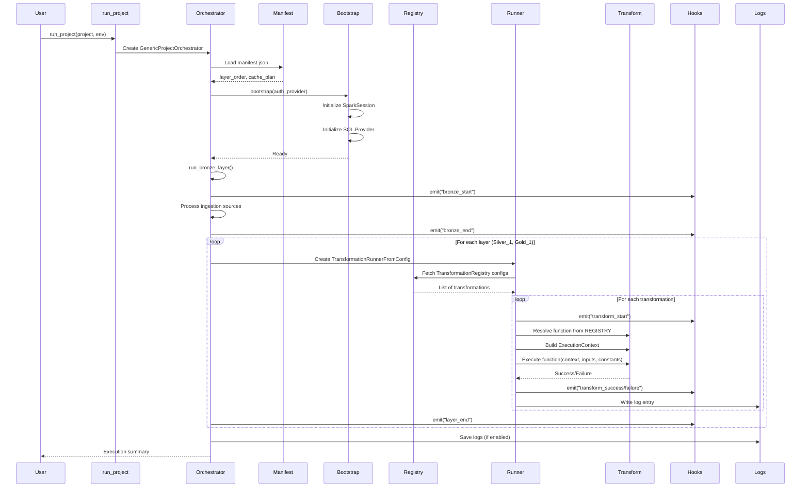

# Execution Flow - Step-by-Step Walkthrough

This guide walks you through a complete pipeline execution, showing exactly what happens when you call `run_project()`.

---

## Table of Contents
- [The Complete Picture](#the-complete-picture)
- [Step-by-Step Execution](#step-by-step-execution)
- [Example Scenario](#example-scenario)
- [Detailed Trace](#detailed-trace)
- [Parallel vs Sequential](#parallel-vs-sequential)
- [Try It Yourself](#try-it-yourself)

---

## The Complete Picture



---

## Step-by-Step Execution

### Step 1: User Calls `run_project()`

**Your Code:**
```python
from odibi_de_v2 import run_project

result = run_project(
    project="Energy Efficiency",
    env="qat",
    log_level="INFO"
)
```

**What Happens:**
- Function located in: [`generic_orchestrator.py:521`](file:///d:/projects/odibi_de_v2/odibi_de_v2/orchestration/generic_orchestrator.py#L521)
- Creates a `GenericProjectOrchestrator` instance
- Passes all parameters to the orchestrator constructor

**Code Trace:**
```python
# File: odibi_de_v2/orchestration/generic_orchestrator.py
def run_project(
    project: str,
    env: str = "qat",
    target_layers: Optional[List[str]] = None,
    cache_plan: Optional[Dict[str, List[str]]] = None,
    manifest_path: Optional[str] = None,
    log_level: str = "WARNING",
    save_logs: bool = False,
    auth_provider: Optional[callable] = None,
    engine: str = "spark",
    hooks: Optional[HookManager] = None,
    log_sink: Optional[BaseLogSink] = None,
    **kwargs
) -> Dict[str, Any]:
    # Create orchestrator
    orchestrator = GenericProjectOrchestrator(
        project=project,
        env=env,
        manifest_path=manifest_path,
        log_level=log_level,
        save_logs=save_logs,
        auth_provider=auth_provider,
        engine=engine,
        hooks=hooks,
        log_sink=log_sink
    )
    
    # Run the pipeline
    return orchestrator.run(**kwargs)
```

---

### Step 2: Orchestrator Loads Manifest

**What Happens:**
- Constructor calls `_load_manifest()` method
- Auto-discovers `manifest.json` from project structure
- Extracts `layer_order` and `cache_plan`

**Code Trace:**
```python
# File: odibi_de_v2/orchestration/generic_orchestrator.py:161
def _load_manifest(self, manifest_path: Optional[Path]) -> Optional[ProjectManifest]:
    """Load project manifest from file or auto-discover"""
    if manifest_path and Path(manifest_path).exists():
        return ProjectManifest.from_json(Path(manifest_path))
    
    # Auto-discover manifest
    project_slug = self.project.lower().replace(" ", "_")  # "energy_efficiency"
    possible_paths = [
        Path(f"projects/{project_slug}/manifest.json"),
        Path(f"./{project_slug}/manifest.json"),
        Path(f"../projects/{project_slug}/manifest.json"),
    ]
    
    for path in possible_paths:
        if path.exists():
            self.logger.log("info", f"📋 Loaded manifest from {path}")
            return ProjectManifest.from_json(path)
```

**Example Manifest:**
```json
{
  "project": "Energy Efficiency",
  "description": "Energy monitoring and efficiency analytics",
  "layer_order": ["Bronze", "Silver_1", "Gold_1"],
  "cache_plan": {
    "Gold_1": ["qat_energy_efficiency.aggregated_metrics"]
  }
}
```

**Console Output:**
```
📋 Loaded manifest from projects/energy_efficiency/manifest.json
```

---

### Step 3: Bootstrap Authentication & Spark

**What Happens:**
- Calls `orchestrator.bootstrap()`
- Initializes authentication provider
- Sets up SparkSession
- Sets up SQL Provider for reading config tables

**Code Trace:**
```python
# File: odibi_de_v2/orchestration/generic_orchestrator.py:188
def bootstrap(self, repo_path: Optional[str] = None):
    """Initialize environment and authentication"""
    self.logger.log("info", f"⚙️ Bootstrapping environment for {self.project.upper()} (env={self.env})")
    
    if self.auth_provider:
        # Use custom authentication provider
        auth_result = self.auth_provider(
            env=self.env,
            repo_path=repo_path,
            logger_metadata={"project": self.project, "stage": "Bootstrap"}
        )
        self.spark = auth_result.get("spark")
        self.sql_provider = auth_result.get("sql_provider")
    else:
        # Use default SparkSession
        self.spark = SparkSession.getActiveSession()
        if not self.spark:
            self.spark = SparkSession.builder.appName(self.project).getOrCreate()
```

**Console Output:**
```
⚙️ Bootstrapping environment for ENERGY EFFICIENCY (env=qat)
Environment bootstrapped
```

---

### Step 4: Load TransformationRegistry Configs

**What Happens:**
- For each layer (Silver_1, Gold_1), creates a `TransformationRunnerFromConfig`
- Runner queries `TransformationRegistry` table from SQL
- Filters by `project`, `env`, `layer`, and `enabled=1`
- Parses JSON fields: `inputs`, `constants`, `outputs`

**Code Trace:**
```python
# File: odibi_de_v2/transformer/transformation_runner_from_config.py:79
def _fetch_configs(self):
    """Fetch transformation configs from TransformationRegistry."""
    query = f"""
    SELECT
        transformation_id as id,
        project,
        environment as env,
        layer,
        entity_1 as plant,
        entity_2 as asset,
        module,
        [function],
        inputs,
        constants,
        outputs,
        enabled
    FROM TransformationRegistry
    WHERE LOWER(project) = LOWER('{self.project}') 
    AND enabled = 1 
    AND environment = '{self.env}'
    AND layer = '{self.layer}'
    """
    
    source_target = self.sql_provider.read(
        data_type=DataType.SQL,
        container="",
        path_prefix="",
        object_name=query,
        spark=self.spark
    )
    
    configs = []
    for row in source_target.collect():
        config = row.asDict()
        
        # Parse JSON fields
        config['inputs'] = json.loads(config['inputs']) if config.get('inputs') else []
        config['constants'] = json.loads(config['constants']) if config.get('constants') else {}
        config['outputs'] = json.loads(config['outputs']) if config.get('outputs') else []
        
        configs.append(config)
    
    return configs
```

---

### Step 5: Execute Transformations

For each transformation config, the runner:

1. **Resolves the function** from REGISTRY or via importlib
2. **Builds ExecutionContext** with engine, Spark, SQL provider
3. **Executes the function** with inputs, constants, outputs
4. **Emits hooks** (transform_start, transform_success/failure)
5. **Logs the result** to `TransformationRunLog` table

**Code Trace:**
```python
# File: odibi_de_v2/transformer/transformation_runner_from_config.py:211
def _run_one(self, cfg, max_retries: int = 3, base_delay: float = 2.0):
    """Execute a single transformation with retry logic."""
    full_module = cfg['module']
    func_name = cfg["function"]
    start_time = time.time()
    
    # Determine engine (Spark or Pandas)
    effective_engine = cfg.get('constants', {}).get('engine', self.engine.value)
    
    # Emit transform_start hook
    self.hooks.emit("transform_start", {
        "transformation_id": cfg.get('id'),
        "project": cfg['project'],
        "module": full_module,
        "function": func_name,
        "engine": effective_engine,
        "layer": self.layer
    })
    
    # Log start to TransformationRunLog
    self._log_start(cfg)
    
    # Resolve function via REGISTRY
    func = REGISTRY.resolve(full_module, func_name, effective_engine)
    
    # Build ExecutionContext
    context = ExecutionContext(
        engine=Engine.SPARK if effective_engine == "spark" else Engine.PANDAS,
        project=cfg['project'],
        env=cfg.get('env', self.env),
        spark=self.spark,
        sql_provider=self.sql_provider,
        logger=self.logger,
        hooks=self.hooks,
        extras={
            "plant": cfg.get('plant'),
            "asset": cfg.get('asset'),
            "layer": self.layer
        }
    )
    
    # Build function arguments
    func_kwargs = {
        'inputs': cfg.get('inputs', []),
        'constants': cfg.get('constants', {}),
        'outputs': cfg.get('outputs', []),
        'spark': self.spark,
        'env': cfg.get('env', self.env)
    }
    
    # Conditionally pass context if function accepts it
    sig = inspect.signature(func)
    if 'context' in sig.parameters:
        func_kwargs['context'] = context
    
    # Execute!
    func(**func_kwargs)
    
    # Log success
    self._log_end(cfg, "SUCCESS", start_time)
    
    # Emit transform_success hook
    self.hooks.emit("transform_success", {
        "transformation_id": cfg.get('id'),
        "project": cfg['project'],
        "module": full_module,
        "function": func_name,
        "duration_seconds": time.time() - start_time
    })
```

---

### Step 6: Save Logs & Finish

**What Happens:**
- Runner writes all execution logs to `config_driven.TransformationRunLog` Delta table
- Orchestrator emits `layer_end` hook
- Returns execution summary to user

**Log Entry Schema:**
```python
{
    "transformation_id": "BRONZE_001",
    "project": "Energy Efficiency",
    "plant": "Plant_A",
    "asset": "Dryer_1",
    "start_time": "2025-01-15 10:30:00",
    "end_time": "2025-01-15 10:30:45",
    "status": "SUCCESS",
    "duration_seconds": 45.2,
    "error_message": None,
    "env": "qat"
}
```

---

## Example Scenario

Let's walk through a simple 3-row TransformationRegistry for a Bronze → Silver → Gold pipeline.

### TransformationRegistry Table

| transformation_id | project | environment | layer | module | function | inputs | constants | outputs | enabled |
|-------------------|---------|-------------|-------|---------|----------|--------|-----------|---------|---------|
| BRONZE_001 | Energy Efficiency | qat | Bronze | odibi_functions.bronze | ingest_sensor_data | [] | `{"source": "adls://raw/sensors.csv"}` | `[{"table": "bronze.raw_sensors"}]` | 1 |
| SILVER_001 | Energy Efficiency | qat | Silver_1 | odibi_functions.silver | clean_sensor_data | `["bronze.raw_sensors"]` | `{"drop_nulls": true}` | `[{"table": "silver.clean_sensors"}]` | 1 |
| GOLD_001 | Energy Efficiency | qat | Gold_1 | odibi_functions.gold | aggregate_hourly | `["silver.clean_sensors"]` | `{"window": "1H"}` | `[{"table": "gold.hourly_metrics"}]` | 1 |

### Execution Flow

```
🚀 Starting pipeline: Energy Efficiency (env=qat)

📋 Loaded manifest from projects/energy_efficiency/manifest.json
⚙️ Bootstrapping environment for ENERGY EFFICIENCY (env=qat)
Environment bootstrapped

🎯 Running layers: ['Bronze', 'Silver_1', 'Gold_1']

━━━━━━━━━━━━━━━━━━━━━━━━━━━━━━━━━━━━━━━━━━━━━━━━━━━━━
Layer: Bronze
━━━━━━━━━━━━━━━━━━━━━━━━━━━━━━━━━━━━━━━━━━━━━━━━━━━━━
⚙️ Starting transformation layer: Bronze
Running [Energy Efficiency]  (odibi_functions.bronze.ingest_sensor_data) [engine=spark]
  → Reading from adls://raw/sensors.csv
  → Writing to bronze.raw_sensors
Success: odibi_functions.bronze.ingest_sensor_data
✅ Layer Bronze completed in 12.3s

━━━━━━━━━━━━━━━━━━━━━━━━━━━━━━━━━━━━━━━━━━━━━━━━━━━━━
Layer: Silver_1
━━━━━━━━━━━━━━━━━━━━━━━━━━━━━━━━━━━━━━━━━━━━━━━━━━━━━
⚙️ Starting transformation layer: Silver_1
Running [Energy Efficiency]  (odibi_functions.silver.clean_sensor_data) [engine=spark]
  → Reading from bronze.raw_sensors
  → Cleaning: drop_nulls=True
  → Writing to silver.clean_sensors
Success: odibi_functions.silver.clean_sensor_data
✅ Layer Silver_1 completed in 8.7s

━━━━━━━━━━━━━━━━━━━━━━━━━━━━━━━━━━━━━━━━━━━━━━━━━━━━━
Layer: Gold_1
━━━━━━━━━━━━━━━━━━━━━━━━━━━━━━━━━━━━━━━━━━━━━━━━━━━━━
⚙️ Starting transformation layer: Gold_1
Running [Energy Efficiency]  (odibi_functions.gold.aggregate_hourly) [engine=spark]
  → Reading from silver.clean_sensors
  → Aggregating with window=1H
  → Writing to gold.hourly_metrics
Success: odibi_functions.gold.aggregate_hourly
📦 Caching tables after Gold_1
✅ Cached table: qat_energy_efficiency.aggregated_metrics
✅ Layer Gold_1 completed in 15.2s

🏁 Transformation processing complete in 36.2s

Pipeline completed successfully!
Status: success
Layers executed: ['Bronze', 'Silver_1', 'Gold_1']
Duration: 36.2 seconds
```

---

## Detailed Trace

### File Flow

```
User Code
    ↓
generic_orchestrator.py:521 → run_project()
    ↓
generic_orchestrator.py:131 → GenericProjectOrchestrator.__init__()
    ↓
generic_orchestrator.py:161 → _load_manifest()
    ↓
generic_orchestrator.py:395 → run()
    ↓
generic_orchestrator.py:188 → bootstrap()
    ↓
generic_orchestrator.py:221 → run_bronze_layer()
    ↓
generic_orchestrator.py:286 → run_silver_gold_layers()
    ↓
transformation_runner_from_config.py:333 → TransformationRunnerFromConfig()
    ↓
transformation_runner_from_config.py:79 → _fetch_configs()
    ↓
transformation_runner_from_config.py:357 → run_parallel()
    ↓
transformation_runner_from_config.py:211 → _run_one()
    ↓
Your transformation function (e.g., odibi_functions.silver.clean_sensor_data)
```

---

## Parallel vs Sequential

### Sequential Execution (`run_all()`)

```python
runner.run_all()  # One transformation at a time
```

**Timeline:**
```
Transform 1 ████████████ (12s)
Transform 2              ████████ (8s)
Transform 3                       ███████ (7s)
────────────────────────────────────────────────
Total: 27 seconds
```

### Parallel Execution (`run_parallel()`)

```python
runner.run_parallel()  # Multiple transformations at once
```

**Timeline:**
```
Transform 1 ████████████ (12s)
Transform 2 ████████ (8s)
Transform 3 ███████ (7s)
────────────────────────────────────────────────
Total: 12 seconds (limited by longest transform)
```

**Code:**
```python
# File: transformation_runner_from_config.py:357
def run_parallel(self):
    """Run transformations in parallel using ThreadPoolExecutor"""
    configs = self._fetch_configs()
    
    with ThreadPoolExecutor(max_workers=self.max_workers) as executor:
        # Submit all transformations to thread pool
        futures = {
            executor.submit(self._run_one, cfg): cfg 
            for cfg in configs
        }
        
        # Wait for all to complete
        for future in as_completed(futures):
            cfg = futures[future]
            try:
                future.result()  # Raises exception if transformation failed
            except Exception as e:
                self.logger.log("error", f"Transform failed: {cfg['function']}")
```

**Key Points:**
- **Within a layer:** Transformations run in parallel (if independent)
- **Across layers:** Layers run sequentially (Bronze → Silver → Gold)
- **Max workers:** Defaults to CPU count (adjustable via `max_workers` parameter)

---

## Try It Yourself

### Exercise 1: Trace a Single Transformation

1. Add a simple transformation to TransformationRegistry:
```sql
INSERT INTO TransformationRegistry VALUES (
    'TEST_001',
    'My Project',
    'qat',
    'Silver_1',
    NULL,  -- plant
    NULL,  -- asset
    'my_module',
    'my_function',
    '["input_table"]',
    '{"param1": "value1"}',
    '[{"table": "output_table", "mode": "overwrite"}]',
    1
);
```

2. Run with verbose logging:
```python
from odibi_de_v2 import run_project

result = run_project(
    project="My Project",
    env="qat",
    target_layers=["Silver_1"],
    log_level="INFO"  # See detailed execution logs
)
```

3. Watch the console output and match it to the execution flow diagram.

### Exercise 2: Inspect Execution Logs

After running a pipeline, query the log table:

```python
from pyspark.sql import SparkSession

spark = SparkSession.getActiveSession()
logs = spark.sql("""
    SELECT 
        transformation_id,
        function,
        status,
        duration_seconds,
        error_message
    FROM config_driven.TransformationRunLog
    WHERE project = 'Energy Efficiency'
    ORDER BY start_time DESC
    LIMIT 10
""")

logs.show(truncate=False)
```

### Exercise 3: Add Custom Hooks

Monitor execution with custom event handlers:

```python
from odibi_de_v2.hooks import HookManager

# Create hook manager
hooks = HookManager()

# Add listeners
hooks.register("transform_start", lambda data: 
    print(f"🚀 Starting: {data['function']}")
)

hooks.register("transform_success", lambda data: 
    print(f"✅ Completed: {data['function']} in {data['duration_seconds']:.1f}s")
)

# Run with hooks
result = run_project(
    project="Energy Efficiency",
    env="qat",
    hooks=hooks
)
```

**Expected Output:**
```
🚀 Starting: ingest_sensor_data
✅ Completed: ingest_sensor_data in 12.3s
🚀 Starting: clean_sensor_data
✅ Completed: clean_sensor_data in 8.7s
```

---

## Summary

The execution flow follows this pattern:

1. **Entry Point:** `run_project()` creates orchestrator
2. **Configuration:** Load manifest, extract layer order
3. **Bootstrap:** Initialize Spark, SQL provider, authentication
4. **Bronze:** Ingest raw data
5. **Silver/Gold:** For each layer:
   - Fetch TransformationRegistry configs
   - Execute transformations in parallel (within layer)
   - Emit hooks and log results
6. **Finish:** Save logs, return summary

**Key Files:**
- [`generic_orchestrator.py`](file:///d:/projects/odibi_de_v2/odibi_de_v2/orchestration/generic_orchestrator.py) - Main orchestration logic
- [`transformation_runner_from_config.py`](file:///d:/projects/odibi_de_v2/odibi_de_v2/transformer/transformation_runner_from_config.py) - Transformation execution
- [`engine.py`](file:///d:/projects/odibi_de_v2/odibi_de_v2/core/engine.py) - ExecutionContext definition

**Next:** Read [04_The_Dual_Engines.md](file:///d:/projects/odibi_de_v2/docs/learn_odibi_de/04_The_Dual_Engines.md) to understand Spark vs Pandas execution.
