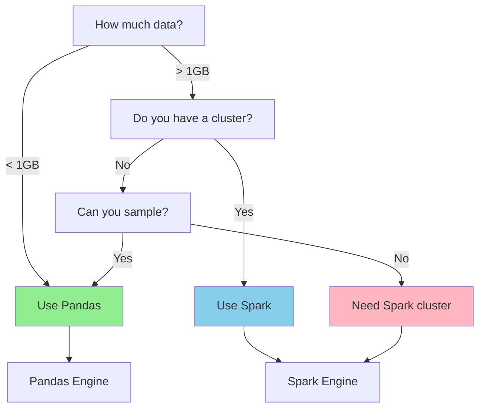
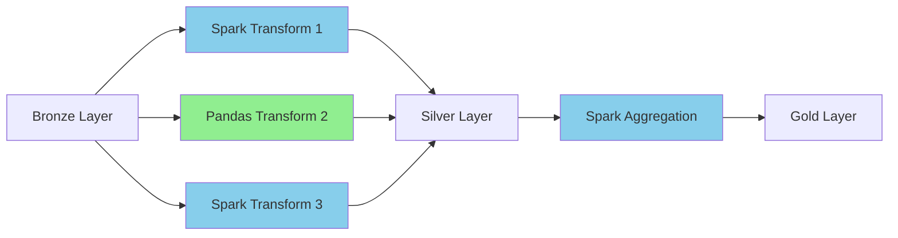

# The Dual Engines - Spark vs Pandas

This guide explains what Spark and Pandas are, when to use each, and how ODIBI DE v2 supports both seamlessly.

---

## Table of Contents
- [What Are Spark and Pandas?](#what-are-spark-and-pandas)
- [When to Use Each Engine](#when-to-use-each-engine)
- [The Same Transformation, Two Engines](#the-same-transformation-two-engines)
- [ExecutionContext: Engine-Agnostic Access](#executioncontext-engine-agnostic-access)
- [Parallel Execution with Different Engines](#parallel-execution-with-different-engines)
- [Performance Considerations](#performance-considerations)
- [Try It Yourself](#try-it-yourself)

---

## What Are Spark and Pandas?

### Apache Spark

**What it is:**
- A **distributed computing engine** that runs on clusters
- Processes data across multiple machines in parallel
- Designed for **big data** (terabytes, petabytes)

**Think of it as:**
A factory with 100 workers who split up a massive task and work together to finish faster.

**Key Features:**
- ✅ Handles massive datasets (billions of rows)
- ✅ Distributed across multiple servers
- ✅ Lazy evaluation (optimizes before executing)
- ✅ Fault-tolerant (survives server failures)
- ❌ Higher overhead for small data
- ❌ Requires cluster resources

**Example:**
```python
from pyspark.sql import SparkSession

spark = SparkSession.builder.getOrCreate()

# Read 10GB of data from Azure
df = spark.read.format("delta").load("abfss://container@account.dfs.core.windows.net/data")

# Process across 100 nodes
result = df.groupBy("sensor_id").agg({"temperature": "avg"})

# Write back to Delta Lake
result.write.format("delta").mode("overwrite").save("output_path")
```

---

### Pandas

**What it is:**
- A **single-machine data analysis library** for Python
- Processes data on one computer's memory
- Designed for **small to medium data** (megabytes, gigabytes)

**Think of it as:**
A skilled craftsman who works alone but extremely fast on smaller jobs.

**Key Features:**
- ✅ Fast for small datasets (< 1GB)
- ✅ Rich ecosystem (scikit-learn, matplotlib, etc.)
- ✅ Easy to use, Pythonic syntax
- ✅ Great for data exploration and prototyping
- ❌ Limited by single machine memory
- ❌ No distributed processing

**Example:**
```python
import pandas as pd

# Read CSV from local file
df = pd.read_csv("sensor_data.csv")

# Process in-memory
result = df.groupby("sensor_id")["temperature"].mean()

# Save to CSV
result.to_csv("output.csv", index=False)
```

---

## When to Use Each Engine



### Decision Matrix

| Scenario | Engine | Why? |
|----------|--------|------|
| **Local development** | Pandas | Fast iteration, no cluster needed |
| **Testing on sample data** | Pandas | Quick feedback, easy debugging |
| **Production pipelines (small data)** | Pandas | Lower cost, simpler infrastructure |
| **Production pipelines (big data)** | Spark | Scales to billions of rows |
| **Real-time streaming** | Spark | Native streaming support |
| **Exploratory analysis** | Pandas | Rich visualization libraries |
| **Distributed joins** | Spark | Can join massive tables efficiently |
| **Machine learning on big data** | Spark | Spark MLlib for distributed ML |

---

## The Same Transformation, Two Engines

Let's write a transformation that **cleans sensor data** and see how it looks in both engines.

### The Task

**Input:** Raw sensor data with nulls and outliers  
**Output:** Clean data with:
- Null values removed
- Temperature outliers filtered (< -50°C or > 150°C)
- Timestamp normalized

---

### Spark Version

```python
# File: odibi_functions/silver/sensor_cleaning_spark.py

from pyspark.sql import SparkSession
from pyspark.sql.functions import col, to_timestamp

def clean_sensor_data_spark(
    inputs: list,
    constants: dict,
    outputs: list,
    spark: SparkSession,
    env: str,
    **kwargs
):
    """
    Clean sensor data using Spark.
    
    Args:
        inputs: List of input table names (e.g., ["bronze.raw_sensors"])
        constants: Config parameters (e.g., {"min_temp": -50, "max_temp": 150})
        outputs: List of output specs (e.g., [{"table": "silver.clean_sensors"}])
        spark: SparkSession instance
        env: Environment (qat/prod)
    """
    # Read from Bronze layer
    input_table = inputs[0]
    df = spark.table(input_table)
    
    # Extract constants
    min_temp = constants.get("min_temp", -50)
    max_temp = constants.get("max_temp", 150)
    
    # Clean the data
    df_clean = df \
        .filter(col("sensor_id").isNotNull()) \
        .filter(col("temperature").isNotNull()) \
        .filter((col("temperature") >= min_temp) & (col("temperature") <= max_temp)) \
        .withColumn("timestamp", to_timestamp(col("timestamp")))
    
    # Write to Silver layer
    output_table = outputs[0]["table"]
    df_clean.write.format("delta").mode("overwrite").saveAsTable(output_table)
    
    print(f"✅ Cleaned {df_clean.count()} records from {input_table} to {output_table}")
```

**Register in TransformationRegistry:**
```sql
INSERT INTO TransformationRegistry VALUES (
    'SILVER_001',
    'Energy Efficiency',
    'qat',
    'Silver_1',
    NULL,
    NULL,
    'odibi_functions.silver.sensor_cleaning_spark',
    'clean_sensor_data_spark',
    '["bronze.raw_sensors"]',
    '{"min_temp": -50, "max_temp": 150}',
    '[{"table": "silver.clean_sensors", "mode": "overwrite"}]',
    1
);
```

---

### Pandas Version

```python
# File: odibi_functions/silver/sensor_cleaning_pandas.py

import pandas as pd
from sqlalchemy import create_engine

def clean_sensor_data_pandas(
    inputs: list,
    constants: dict,
    outputs: list,
    env: str,
    context = None,
    **kwargs
):
    """
    Clean sensor data using Pandas.
    
    Args:
        inputs: List of input table names (e.g., ["bronze.raw_sensors"])
        constants: Config parameters (e.g., {"min_temp": -50, "max_temp": 150})
        outputs: List of output specs (e.g., [{"table": "silver.clean_sensors"}])
        env: Environment (qat/prod)
        context: ExecutionContext with engine, logger, etc.
    """
    # Read from CSV or database (example uses CSV)
    input_path = inputs[0]  # e.g., "data/bronze/raw_sensors.csv"
    df = pd.read_csv(input_path)
    
    # Extract constants
    min_temp = constants.get("min_temp", -50)
    max_temp = constants.get("max_temp", 150)
    
    # Clean the data
    df_clean = df.dropna(subset=["sensor_id", "temperature"])
    df_clean = df_clean[
        (df_clean["temperature"] >= min_temp) & 
        (df_clean["temperature"] <= max_temp)
    ]
    df_clean["timestamp"] = pd.to_datetime(df_clean["timestamp"])
    
    # Write to output
    output_path = outputs[0]["table"]  # e.g., "data/silver/clean_sensors.csv"
    df_clean.to_csv(output_path, index=False)
    
    print(f"✅ Cleaned {len(df_clean)} records from {input_path} to {output_path}")
```

**Register in TransformationRegistry:**
```sql
INSERT INTO TransformationRegistry VALUES (
    'SILVER_001_PANDAS',
    'Energy Efficiency',
    'dev',  -- Use Pandas in dev environment
    'Silver_1',
    NULL,
    NULL,
    'odibi_functions.silver.sensor_cleaning_pandas',
    'clean_sensor_data_pandas',
    '["data/bronze/raw_sensors.csv"]',
    '{"min_temp": -50, "max_temp": 150}',
    '[{"table": "data/silver/clean_sensors.csv"}]',
    1
);
```

---

### Side-by-Side Comparison

| Operation | Spark | Pandas |
|-----------|-------|--------|
| **Read data** | `spark.table("bronze.raw_sensors")` | `pd.read_csv("raw_sensors.csv")` |
| **Filter nulls** | `.filter(col("sensor_id").isNotNull())` | `.dropna(subset=["sensor_id"])` |
| **Filter range** | `.filter((col("temp") >= -50) & (col("temp") <= 150))` | `df[(df["temp"] >= -50) & (df["temp"] <= 150)]` |
| **Convert timestamp** | `.withColumn("ts", to_timestamp(col("ts")))` | `df["ts"] = pd.to_datetime(df["ts"])` |
| **Write data** | `.write.format("delta").saveAsTable("output")` | `df.to_csv("output.csv")` |
| **Count rows** | `df.count()` | `len(df)` |

**Key Difference:**
- **Spark:** Lazy evaluation (builds query plan, executes on action like `.count()`)
- **Pandas:** Eager evaluation (executes each line immediately)

---

## ExecutionContext: Engine-Agnostic Access

The `ExecutionContext` class provides a unified interface regardless of engine.

### What is ExecutionContext?

```python
# File: odibi_de_v2/core/engine.py:28

@dataclass
class ExecutionContext:
    """
    Execution context for dual-engine pipelines.
    
    Attributes:
        engine: The execution engine (SPARK or PANDAS)
        project: Project identifier
        env: Environment identifier (e.g., 'dev', 'prod')
        spark: SparkSession instance (optional, only for SPARK engine)
        sql_provider: SQL query provider
        logger: Logger instance
        hooks: Hook manager for events
        extras: Arbitrary key-value pairs for extensibility
    """
    engine: Engine
    project: str
    env: str
    spark: Optional[Any] = None
    sql_provider: Optional[Any] = None
    logger: Optional[Any] = None
    hooks: Optional[Any] = None
    extras: Dict[str, Any] = field(default_factory=dict)
```

### Engine-Agnostic Function

Write once, run on both engines:

```python
from odibi_de_v2.core import ExecutionContext, Engine

def smart_aggregation(
    inputs: list,
    constants: dict,
    outputs: list,
    context: ExecutionContext,
    **kwargs
):
    """
    Aggregate data using whichever engine is configured.
    """
    input_table = inputs[0]
    output_table = outputs[0]["table"]
    agg_column = constants.get("agg_column", "value")
    
    if context.engine == Engine.SPARK:
        # Use Spark
        df = context.spark.table(input_table)
        result = df.groupBy("sensor_id").agg({agg_column: "avg"})
        result.write.format("delta").mode("overwrite").saveAsTable(output_table)
        
    elif context.engine == Engine.PANDAS:
        # Use Pandas
        import pandas as pd
        df = pd.read_csv(input_table)
        result = df.groupby("sensor_id")[agg_column].mean().reset_index()
        result.to_csv(output_table, index=False)
    
    context.logger.log("info", f"✅ Aggregation complete using {context.engine.value}")
```

**Run with Spark:**
```python
from odibi_de_v2 import run_project

result = run_project(
    project="Energy Efficiency",
    env="prod",
    engine="spark"  # Uses Spark engine
)
```

**Run with Pandas:**
```python
result = run_project(
    project="Energy Efficiency",
    env="dev",
    engine="pandas"  # Uses Pandas engine
)
```

---

## Parallel Execution with Different Engines

You can run **multiple transformations in parallel**, each using a different engine!

### Mixed Engine Pipeline



**TransformationRegistry:**
```sql
-- Transform 1: Spark (large dataset)
INSERT INTO TransformationRegistry VALUES (
    'SILVER_001', 'My Project', 'qat', 'Silver_1', NULL, NULL,
    'my_module', 'transform_large_data',
    '["bronze.large_table"]', '{"engine": "spark"}', '[{"table": "silver.table1"}]', 1
);

-- Transform 2: Pandas (small dataset, needs sklearn)
INSERT INTO TransformationRegistry VALUES (
    'SILVER_002', 'My Project', 'qat', 'Silver_1', NULL, NULL,
    'my_module', 'ml_feature_engineering',
    '["bronze.small_table"]', '{"engine": "pandas"}', '[{"table": "silver.table2"}]', 1
);

-- Transform 3: Spark (distributed join)
INSERT INTO TransformationRegistry VALUES (
    'SILVER_003', 'My Project', 'qat', 'Silver_1', NULL, NULL,
    'my_module', 'join_large_tables',
    '["bronze.table_a", "bronze.table_b"]', '{"engine": "spark"}', 
    '[{"table": "silver.table3"}]', 1
);
```

**Execution Timeline:**
```
Time: 0s                    10s                   20s
      ├───────────────────┼────────────────────┤
T1    ████████████████████████████ (Spark - 25s)
T2    ██████████ (Pandas - 10s)
T3    ████████████████ (Spark - 15s)
      └───────────────────┴────────────────────┘
                   All run in parallel!
Total: 25s (limited by longest task)
```

**How it works:**
1. TransformationRunner checks the `constants.engine` field for each transformation
2. Creates appropriate `ExecutionContext` with the specified engine
3. Executes all transformations in parallel using `ThreadPoolExecutor`
4. Each thread uses its assigned engine (Spark or Pandas)

---

## Performance Considerations

### Memory Usage

**Spark:**
- Distributes memory across cluster nodes
- Can process datasets larger than any single machine's RAM
- Uses disk spillover if needed

**Pandas:**
- Limited by single machine RAM
- Rule of thumb: Need 3-5x dataset size in RAM (for transformations)
- Example: 1GB CSV needs ~5GB RAM to process safely

### Speed Comparison

**Small Data (< 100MB):**
```
Pandas:  ████ 2 seconds
Spark:   ████████████ 12 seconds (cluster startup overhead)
```

**Medium Data (1-10GB):**
```
Pandas:  ████████████████████ 45 seconds (single core)
Spark:   ████████ 15 seconds (distributed across 8 cores)
```

**Large Data (> 100GB):**
```
Pandas:  ❌ Out of memory
Spark:   ████████████ 3 minutes (distributed across 100 cores)
```

### Cost Considerations

**Pandas:**
- ✅ Free (runs on existing machine)
- ✅ No cluster management
- ❌ Limited scalability

**Spark:**
- ❌ Requires cluster (Databricks, EMR, etc.)
- ❌ Higher infrastructure costs
- ✅ Scales to unlimited data
- ✅ Can process petabytes

### Best Practices

1. **Start with Pandas in development**
   ```python
   # Development
   run_project(project="My Project", env="dev", engine="pandas")
   ```

2. **Switch to Spark in production**
   ```python
   # Production
   run_project(project="My Project", env="prod", engine="spark")
   ```

3. **Use Pandas for small, specialized tasks**
   - Machine learning with scikit-learn
   - Data visualization
   - Quick prototyping

4. **Use Spark for heavy lifting**
   - Large-scale ETL
   - Distributed joins
   - Production pipelines

---

## Try It Yourself

### Exercise 1: Write a Dual-Engine Function

Create a function that works with both engines:

```python
# File: my_functions/dual_engine_demo.py

from odibi_de_v2.core import ExecutionContext, Engine

def count_records(
    inputs: list,
    constants: dict,
    outputs: list,
    context: ExecutionContext,
    **kwargs
):
    """Count records using either Spark or Pandas."""
    input_source = inputs[0]
    
    if context.engine == Engine.SPARK:
        df = context.spark.table(input_source)
        count = df.count()
        print(f"[Spark] Found {count} records in {input_source}")
    
    elif context.engine == Engine.PANDAS:
        import pandas as pd
        df = pd.read_csv(input_source)
        count = len(df)
        print(f"[Pandas] Found {count} records in {input_source}")
    
    return count
```

**Test it:**
```python
# With Spark
run_project(project="Test", env="qat", engine="spark")

# With Pandas
run_project(project="Test", env="dev", engine="pandas")
```

### Exercise 2: Compare Performance

Run the same transformation with both engines and time them:

```python
import time

# Spark
start = time.time()
run_project(project="Benchmark", env="qat", engine="spark")
spark_time = time.time() - start

# Pandas
start = time.time()
run_project(project="Benchmark", env="qat", engine="pandas")
pandas_time = time.time() - start

print(f"Spark: {spark_time:.2f}s")
print(f"Pandas: {pandas_time:.2f}s")
print(f"Speedup: {pandas_time/spark_time:.2f}x")
```

### Exercise 3: Mixed-Engine Pipeline

Create a pipeline that uses both engines:

```sql
-- Large data processing with Spark
INSERT INTO TransformationRegistry VALUES (
    'T1', 'Mixed Pipeline', 'qat', 'Silver_1', NULL, NULL,
    'my_module', 'process_big_data',
    '["bronze.large"]', '{"engine": "spark"}', 
    '[{"table": "silver.processed"}]', 1
);

-- Statistical analysis with Pandas (using scipy, statsmodels)
INSERT INTO TransformationRegistry VALUES (
    'T2', 'Mixed Pipeline', 'qat', 'Silver_1', NULL, NULL,
    'my_module', 'statistical_analysis',
    '["bronze.small"]', '{"engine": "pandas"}', 
    '[{"table": "silver.stats"}]', 1
);
```

---

## Summary

### Key Takeaways

1. **Spark = Big Data, Distributed**
   - Use for production pipelines with large datasets
   - Requires cluster infrastructure

2. **Pandas = Small Data, Fast Iteration**
   - Use for development, prototyping, specialized tasks
   - Runs on any machine

3. **ExecutionContext = Engine-Agnostic**
   - Write once, run on both engines
   - Switch engines with a single parameter

4. **Mixed Pipelines = Best of Both Worlds**
   - Use Spark for heavy lifting
   - Use Pandas for specialized analysis
   - Run them in parallel!

### Quick Reference

```python
# Spark Pipeline
from odibi_de_v2 import run_project

run_project(
    project="My Project",
    env="prod",
    engine="spark",  # Distributed processing
    auth_provider=my_auth_function
)

# Pandas Pipeline
run_project(
    project="My Project",
    env="dev",
    engine="pandas",  # Local processing
    save_logs=False
)

# Engine-Agnostic Function
def my_transform(inputs, constants, outputs, context, **kwargs):
    if context.engine == Engine.SPARK:
        # Spark implementation
        df = context.spark.table(inputs[0])
        # ...
    elif context.engine == Engine.PANDAS:
        # Pandas implementation
        df = pd.read_csv(inputs[0])
        # ...
```

**Related Guides:**
- [03_Execution_Flow.md](file:///d:/projects/odibi_de_v2/docs/learn_odibi_de/03_Execution_Flow.md) - How execution flows through the system
- [02_Configuration_Deep_Dive.md](file:///d:/projects/odibi_de_v2/docs/learn_odibi_de/02_Configuration_Deep_Dive.md) - TransformationRegistry configuration (if exists)
